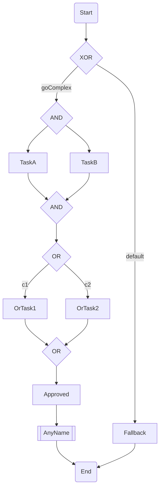

# Flow Lab

轻量级 Mermaid 流程引擎（Java 17 / Spring Boot），支持把 Mermaid DSL 解析成流程定义并执行。

## 1. 项目定位

- 输入：Mermaid `flowchart` DSL
- 输出：可执行流程实例（`ProcessInstance`）
- 执行模型：`Token` 流转 + 指令驱动（`Move/Fork/Join/Complete/Fail`）
- 适用场景：规则编排、审批流、子流程编排、任务节点扩展

## 2. 当前能力

### 2.1 节点与网关

- `START/END/TASK/SUB_PROCESS/GATEWAY`
- 网关类型：
  - `XOR`（排他）
  - `AND`（并行）
  - `OR`（包容）

### 2.2 表达式能力

- 边标签条件支持 SpEL（默认引擎：`SpelExpressionEngine`）
- 示例：`amount > 1000`、`region == 'CN'`、`approved`

### 2.3 任务节点（`nodeId -> beanId`）

- `TASK` 节点可映射 Spring Bean：`nodeId == beanId`
- Bean 需实现 `FlowTask`
- 非 Spring 场景可 `registerTask(nodeId, FlowTask)`

### 2.4 子流程调用

- `[[]]` 表示子流程节点类型（`SUB_PROCESS`）
- 子流程 ID 必须通过 `%% @node:<nodeId> subProcessId=<processId>` 显式配置
- 子流程默认复用父流程变量上下文（同一份 `VariableStore`）

### 2.5 流程中断

- `FlowTask` 内可通过 `TaskContext#interruptProcess(reason)` 主动中断整个流程
- 状态变为 `INTERRUPTED`

### 2.6 拦截器

- 节点级：`NodeInterceptor`
- 流程级：`ProcessInterceptor`

## 3. Mermaid DSL 约定

### 3.1 基础节点

- 开始/结束：`S(Start)` / `E(End)`
- 任务：`T1[Task]`
- 子流程：`SP1[[SubFlowNode]]`
- 网关：
  - `G1{XOR}`
  - `G2{AND}`
  - `G3{OR}`

### 3.2 边标签

- 默认分支：`|default|`
- 条件分支：`|amount > 1000|`

### 3.3 注解增强（`%%`）

- 节点增强：`%% @node:<nodeId> k=v ...`
- Scope 增强：`%% @scope:<gatewayId> k=v ...`
- 子流程绑定（必须）：`%% @node:CallChild subProcessId=childFlow`

### 3.4 节点增强支持清单

当前可在 DSL 中声明的常见节点增强键：

- `subProcessId`（`@node`）：
  - 适用：`SUB_PROCESS` 节点
  - 状态：已生效（用于指定调用的子流程 ID）
- `timeout` / `retry` / `async`（`@node`）：
  - 适用：`TASK` 节点
  - 状态：已生效
  - 语义：
    - `retry`：失败重试次数（如 `retry=2` 表示最多执行 3 次）
    - `timeout`：单次任务执行超时时间（ISO-8601 Duration，如 `PT5S`）
    - `async`：任务在线程池执行（线程名前缀 `flow-task-`）
- `scope.timeout` / `scope.cancelStrategy` / `scope.onChildError`（`@scope`）：
  - 适用：网关节点
  - 状态：已解析；其中 `scope.timeout + cancelStrategy=flow` 会触发解析期约束校验（要求存在 `|timeout|` 出边），其余运行时语义暂未实现

## 4. 快速开始

### 4.1 解析 DSL

```java
ProcessParser parser = new MermaidProcessParser();
ProcessDefinition def = parser.parse("orderFlow", dsl);
```

### 4.2 创建引擎并部署

```java
DefaultProcessEngine engine = new DefaultProcessEngine();
engine.deploy(def);
```

### 4.3 启动流程

```java
ProcessInstance instance = engine.start("orderFlow", Map.of("amount", 1200));
String instanceId = instance.getId();
```

### 4.4 注册任务（非 Spring）

```java
engine.registerTask("prepareTask", ctx -> {
    Integer amount = ctx.getVariableOrDefault("amount", Integer.class, 0);
    ctx.setVariable("approved", amount > 1000);
});
```

### 4.5 Spring Bean 映射任务

```java
@Bean("prepareTask")
public FlowTask prepareTask() {
    return ctx -> ctx.setVariable("approved", true);
}

DefaultProcessEngine engine = new DefaultProcessEngine(definitionStore, applicationContext);
```

## 5. TaskContext 常用方法

- `getVariable(key)`
- `getVariable(key, type)`
- `getVariableOrDefault(key, type, defaultValue)`
- `setVariable(key, value)`
- `interruptProcess(reason)`
- `interrupted()`

## 6. 一个复杂流程示例



## 7. 运行测试

```bash
mvn clean test
```

当前集成测试已覆盖：

- 全网关流程（XOR/AND/OR）
- 异常流程
- 多实例隔离
- 拦截器顺序
- `%%` 注解解析
- Spring Bean 任务映射
- Task 中断流程
- 子流程调用与上下文复用

## 8. 当前实现边界

- 内存态实现（定义、实例、变量）
- 单机单进程执行模型
- 子流程调用为同步执行
- `getInstanceStatus/registerTask/deploy` 在 `DefaultProcessEngine` 提供（`ProcessEngine` 接口目前仅暴露 `start`）
