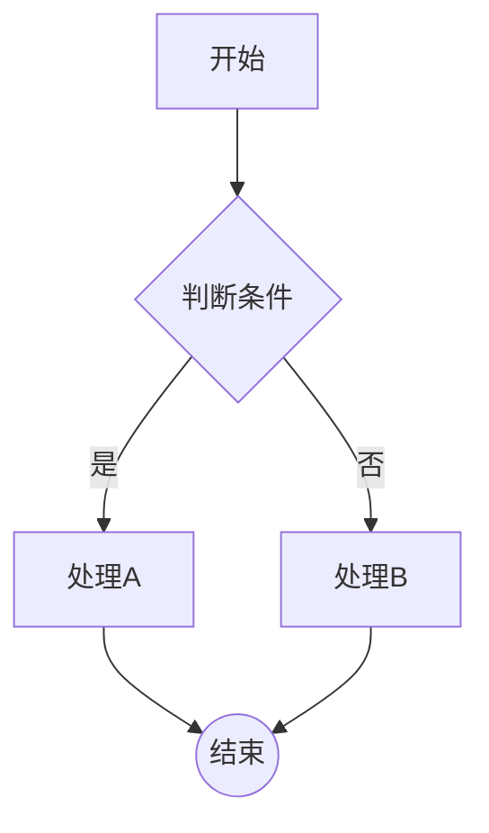
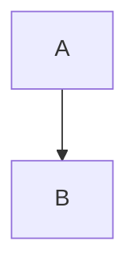
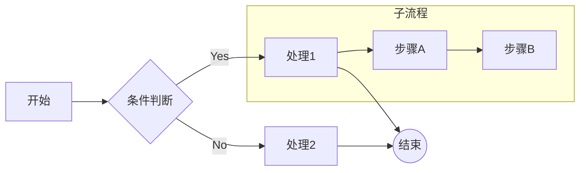
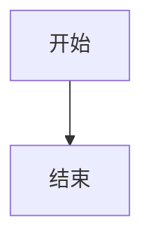
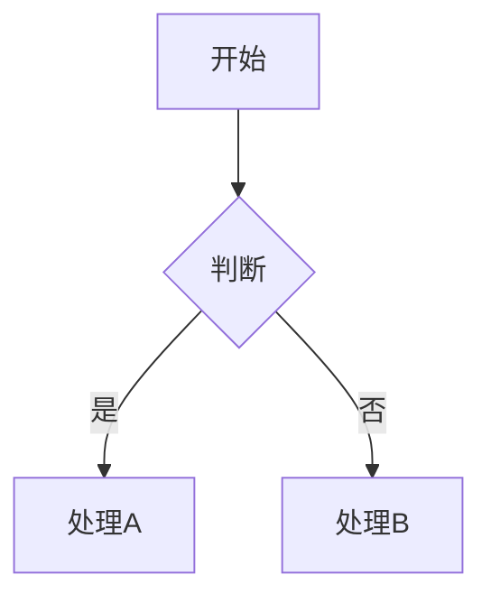

# Mermaid 流程图解析器技术方案

## 一、需求概述

### 1.1 目标
实现一个将 Mermaid 语法的流程图转换为点线结构 JSON 的解析器，为流程引擎提供数据支持。

### 1.2 输入格式
Mermaid flowchart 语法，示例：


### 1.3 输出格式
点线结构的 JSON：
```json
{
  "nodes": [
    {
      "id": "A",
      "label": "开始",
      "type": "rectangle",
      "shape": "rectangle"
    },
    {
      "id": "B",
      "label": "判断条件",
      "type": "diamond",
      "shape": "diamond"
    },
    {
      "id": "C",
      "label": "处理A",
      "type": "rectangle",
      "shape": "rectangle"
    },
    {
      "id": "D",
      "label": "处理B",
      "type": "rectangle",
      "shape": "rectangle"
    },
    {
      "id": "E",
      "label": "结束",
      "type": "circle",
      "shape": "circle"
    }
  ],
  "edges": [
    {
      "from": "A",
      "to": "B",
      "label": ""
    },
    {
      "from": "B",
      "to": "C",
      "label": "是"
    },
    {
      "from": "B",
      "to": "D",
      "label": "否"
    },
    {
      "from": "C",
      "to": "E",
      "label": ""
    },
    {
      "from": "D",
      "to": "E",
      "label": ""
    }
  ]
}
```

### 1.4 功能范围
支持的 Mermaid 特性：
- ✅ 节点形状：
  - `[文本]` - 矩形
  - `{文本}` - 菱形（决策节点）
  - `((文本))` - 圆形
  - `([文本])` - 圆角矩形
- ✅ 连接线：实线箭头 `-->`
- ✅ 带标签的连接：`-->|标签|`
- ✅ 文本标签
- ✅ 子图（subgraph）

暂不支持的特性：
- ❌ 虚线、粗线等其他连接线类型
- ❌ 样式定义（classDef、style）
- ❌ 点击事件
- ❌ 注释

---

## 二、技术架构

### 2.1 整体架构
```
┌─────────────────┐
│  Mermaid 文本   │
└────────┬────────┘
         │
         ▼
┌─────────────────┐
│  词法分析器      │  (Lexer)
│  (Tokenizer)    │
└────────┬────────┘
         │
         ▼
┌─────────────────┐
│  语法分析器      │  (Parser)
│  (AST Builder)  │
└────────┬────────┘
         │
         ▼
┌─────────────────┐
│  语义分析器      │  (Semantic Analyzer)
│  (Validator)    │
└────────┬────────┘
         │
         ▼
┌─────────────────┐
│  转换器          │  (Transformer)
│  (JSON Builder) │
└────────┬────────┘
         │
         ▼
┌─────────────────┐
│  点线 JSON      │
└─────────────────┘
```

### 2.2 分层设计

#### Layer 1: 词法分析层 (Lexical Analysis)
- **职责**：将原始文本分解为 Token 序列
- **输入**：Mermaid 文本字符串
- **输出**：Token 列表

#### Layer 2: 语法分析层 (Syntax Analysis)
- **职责**：根据 Token 构建抽象语法树（AST）
- **输入**：Token 列表
- **输出**：AST（抽象语法树）

#### Layer 3: 语义分析层 (Semantic Analysis)
- **职责**：验证语法树的语义正确性
- **输入**：AST
- **输出**：验证后的 AST 或错误信息

#### Layer 4: 转换层 (Transformation)
- **职责**：将 AST 转换为目标 JSON 结构
- **输入**：AST
- **输出**：点线结构 JSON

---

## 三、核心模块设计

### 3.1 模块划分

```
com.gaibu.flowlab
├── parser                    # 解析器模块
│   ├── lexer                # 词法分析
│   │   ├── Token.java       # Token 定义
│   │   ├── TokenType.java   # Token 类型枚举
│   │   └── MermaidLexer.java # 词法分析器
│   ├── ast                  # 抽象语法树
│   │   ├── ASTNode.java     # AST 节点基类
│   │   ├── FlowchartNode.java    # 流程图节点
│   │   ├── EdgeNode.java         # 边节点
│   │   ├── SubgraphNode.java     # 子图节点
│   │   └── FlowchartAST.java     # 完整的 AST
│   ├── syntax               # 语法分析
│   │   └── MermaidParser.java    # 语法分析器
│   └── semantic             # 语义分析
│       └── SemanticAnalyzer.java # 语义分析器
├── transformer              # 转换器模块
│   ├── model               # 输出数据模型
│   │   ├── Node.java       # 节点模型
│   │   ├── Edge.java       # 边模型
│   │   └── FlowGraph.java  # 图模型
│   └── MermaidTransformer.java   # AST 到 JSON 转换器
├── service                  # 服务层
│   └── FlowParserService.java    # 对外服务接口
└── exception                # 异常定义
    ├── ParseException.java
    └── ValidationException.java
```

### 3.2 核心类说明

#### 3.2.1 Token（词法单元）
```java
public class Token {
    private TokenType type;      // Token 类型
    private String value;        // Token 值
    private int line;            // 所在行号
    private int column;          // 所在列号
}
```

#### 3.2.2 TokenType（Token 类型）
```java
public enum TokenType {
    // 关键字
    FLOWCHART,      // flowchart
    GRAPH,          // graph
    SUBGRAPH,       // subgraph
    END,            // end

    // 方向
    TD,             // Top Down
    LR,             // Left Right

    // 节点形状标记
    BRACKET_OPEN,   // [
    BRACKET_CLOSE,  // ]
    BRACE_OPEN,     // {
    BRACE_CLOSE,    // }
    PAREN_OPEN,     // (
    PAREN_CLOSE,    // )

    // 连接符
    ARROW,          // -->
    PIPE,           // |

    // 其他
    IDENTIFIER,     // 标识符（节点 ID）
    TEXT,           // 文本内容
    NEWLINE,        // 换行
    EOF             // 文件结束
}
```

#### 3.2.3 FlowchartNode（流程图节点）
```java
public class FlowchartNode extends ASTNode {
    private String id;           // 节点 ID
    private String label;        // 节点标签
    private NodeShape shape;     // 节点形状
}
```

#### 3.2.4 EdgeNode（边节点）
```java
public class EdgeNode extends ASTNode {
    private String fromId;       // 起始节点 ID
    private String toId;         // 目标节点 ID
    private String label;        // 边标签
    private EdgeType type;       // 边类型（实线、虚线等）
}
```

#### 3.2.5 输出模型
```java
// 节点模型
public class Node {
    private String id;
    private String label;
    private String type;
    private String shape;
}

// 边模型
public class Edge {
    private String from;
    private String to;
    private String label;
}

// 图模型
public class FlowGraph {
    private List<Node> nodes;
    private List<Edge> edges;
}
```

---

## 四、解析流程详解

### 4.1 词法分析流程

**输入示例**：
```
flowchart TD
    A[开始] --> B{判断}
```

**Token 序列**：
```
[FLOWCHART, "flowchart"]
[TD, "TD"]
[NEWLINE]
[IDENTIFIER, "A"]
[BRACKET_OPEN, "["]
[TEXT, "开始"]
[BRACKET_CLOSE, "]"]
[ARROW, "-->"]
[IDENTIFIER, "B"]
[BRACE_OPEN, "{"]
[TEXT, "判断"]
[BRACE_CLOSE, "}"]
[EOF]
```

**核心算法**：
1. 使用状态机进行 Token 识别
2. 跳过空白字符
3. 识别关键字、标识符、符号
4. 处理文本引号和特殊字符

### 4.2 语法分析流程

**语法规则（BNF）**：
```
<flowchart> ::= "flowchart" <direction> <statements>
<direction> ::= "TD" | "LR" | "TB" | "RL"
<statements> ::= <statement>*
<statement> ::= <node-def> | <edge-def> | <subgraph>

<node-def> ::= <id> <shape>
<shape> ::= "[" <text> "]"           # 矩形
          | "{" <text> "}"           # 菱形
          | "((" <text> "))"         # 圆形
          | "([" <text> "])"         # 圆角矩形

<edge-def> ::= <id> <connector> <id>
<connector> ::= "-->" | "-->|" <text> "|"

<subgraph> ::= "subgraph" <text> <statements> "end"
```

**解析策略**：
- 递归下降解析（Recursive Descent Parsing）
- 向前看 1 个 Token（LL(1)）

### 4.3 语义分析

**验证规则**：
1. 节点 ID 唯一性检查
2. 边引用的节点必须存在
3. 子图嵌套合法性
4. 检测循环依赖（可选）

### 4.4 转换流程

**AST → JSON 转换步骤**：
1. 遍历 AST 中的所有 FlowchartNode
2. 提取节点信息构建 Node 对象
3. 遍历 AST 中的所有 EdgeNode
4. 提取边信息构建 Edge 对象
5. 组装成 FlowGraph 对象
6. 序列化为 JSON

---

## 五、技术选型

### 5.1 核心依赖

| 技术/库 | 版本 | 用途 |
|--------|------|------|
| Spring Boot | 4.0.1 | 应用框架 |
| Jackson | 2.x | JSON 序列化 |
| Lombok | Latest | 减少样板代码 |
| JUnit 5 | 5.x | 单元测试 |
| AssertJ | 3.x | 测试断言 |

### 5.2 为什么不使用现成的 Mermaid 解析库？

**考虑的方案**：
1. **JavaScript 库（mermaid.js）+ Nashorn/GraalVM**
   - ❌ 依赖重、性能差
   - ❌ Java 版本兼容性问题

2. **ANTLR4 生成解析器**
   - ❌ 过于重量级
   - ❌ 学习成本高
   - ✅ 适合更复杂的语法

3. **手写递归下降解析器**（推荐）
   - ✅ 轻量级、无额外依赖
   - ✅ 可控性强、易于调试
   - ✅ 性能好
   - ✅ 适合 Mermaid 这种相对简单的语法

### 5.3 JSON 库选择：Jackson
- Spring Boot 默认集成
- 性能优秀
- 注解简洁
- 生态成熟

---

## 六、实现步骤

### Phase 1: 基础框架搭建（优先级：P0）
- [ ] 创建项目模块结构
- [ ] 定义数据模型（Node、Edge、FlowGraph）
- [ ] 定义异常类
- [ ] 添加必要的 Maven 依赖

### Phase 2: 词法分析器（优先级：P0）
- [ ] 实现 Token 和 TokenType
- [ ] 实现 MermaidLexer
- [ ] 编写词法分析器单元测试

### Phase 3: 语法分析器（优先级：P0）
- [ ] 定义 AST 节点类
- [ ] 实现 MermaidParser（递归下降）
- [ ] 编写语法分析器单元测试

### Phase 4: 转换器（优先级：P0）
- [ ] 实现 MermaidTransformer
- [ ] AST 到 JSON 的转换逻辑
- [ ] 编写转换器单元测试

### Phase 5: 服务层封装（优先级：P1）
- [ ] 实现 FlowParserService
- [ ] 提供统一的解析接口
- [ ] 编写集成测试

### Phase 6: 语义分析器（优先级：P2）
- [ ] 实现 SemanticAnalyzer
- [ ] 节点唯一性验证
- [ ] 边引用验证
- [ ] 编写验证测试

### Phase 7: 高级特性（优先级：P3）
- [ ] 支持子图（subgraph）
- [ ] 支持更多节点形状
- [ ] 错误信息优化

---

## 七、测试计划

### 7.1 单元测试
- **词法分析器测试**：验证各种 Token 的正确识别
- **语法分析器测试**：验证 AST 构建的正确性
- **转换器测试**：验证 JSON 输出的正确性

### 7.2 集成测试
- 端到端测试：从 Mermaid 文本到 JSON 的完整流程

### 7.3 测试用例

#### 基础测试用例


#### 复杂测试用例


#### 边界测试
- 空流程图
- 只有一个节点
- 大量节点（性能测试）
- 包含特殊字符的标签

---

## 八、预期输出示例

### 示例 1：简单流程

**输入**：


**输出**：
```json
{
  "nodes": [
    {
      "id": "A",
      "label": "开始",
      "type": "rectangle",
      "shape": "rectangle"
    },
    {
      "id": "B",
      "label": "结束",
      "type": "rectangle",
      "shape": "rectangle"
    }
  ],
  "edges": [
    {
      "from": "A",
      "to": "B",
      "label": ""
    }
  ]
}
```

### 示例 2：决策流程

**输入**：


**输出**：
```json
{
  "nodes": [
    {
      "id": "A",
      "label": "开始",
      "type": "rectangle",
      "shape": "rectangle"
    },
    {
      "id": "B",
      "label": "判断",
      "type": "diamond",
      "shape": "diamond"
    },
    {
      "id": "C",
      "label": "处理A",
      "type": "rectangle",
      "shape": "rectangle"
    },
    {
      "id": "D",
      "label": "处理B",
      "type": "rectangle",
      "shape": "rectangle"
    }
  ],
  "edges": [
    {
      "from": "A",
      "to": "B",
      "label": ""
    },
    {
      "from": "B",
      "to": "C",
      "label": "是"
    },
    {
      "from": "B",
      "to": "D",
      "label": "否"
    }
  ]
}
```

---

## 九、性能考虑

### 9.1 性能目标
- 解析 100 个节点的流程图 < 100ms
- 内存占用 < 50MB

### 9.2 优化策略
- 使用 StringBuilder 拼接字符串
- 避免不必要的对象创建
- Token 缓存复用
- 延迟初始化

---

## 十、扩展性设计

### 10.1 支持多种输入格式
- 当前：Mermaid flowchart
- 未来：Mermaid sequence diagram、PlantUML 等

### 10.2 支持多种输出格式
- 当前：点线 JSON
- 未来：GraphML、DOT 等

### 10.3 插件化架构
```
ParserRegistry -> 注册多种解析器
TransformerRegistry -> 注册多种转换器
```

---

## 十一、风险与挑战

### 11.1 技术风险
| 风险 | 影响 | 应对措施 |
|-----|------|---------|
| Mermaid 语法复杂度被低估 | 高 | 分阶段实现，先支持核心语法 |
| 性能不达标 | 中 | 性能测试 + 优化 |
| 语法解析错误处理不当 | 中 | 详细的错误信息和单元测试 |

### 11.2 开发风险
| 风险 | 影响 | 应对措施 |
|-----|------|---------|
| 开发时间超期 | 中 | 按优先级分阶段交付 |
| 测试覆盖率不足 | 高 | TDD 开发 + Code Review |

---

## 十二、总结

本方案采用经典的编译原理技术（词法分析 → 语法分析 → 语义分析 → 转换），将 Mermaid 流程图文本转换为点线结构的 JSON。

**核心优势**：
1. ✅ **轻量级**：无重度依赖，纯 Java 实现
2. ✅ **高性能**：手写解析器，性能可控
3. ✅ **可扩展**：模块化设计，易于扩展新功能
4. ✅ **可维护**：清晰的分层架构，代码易读

**下一步行动**：
1. 评审本技术方案
2. 确认需求和优先级
3. 开始 Phase 1 开发
