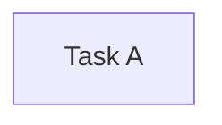

# Mermaid Workflow Engine 设计规范 v1.2

---

# 0. 框架定位

Mermaid Workflow Engine 是一个：

> 基于 Markdown + Mermaid Flowchart 子集语法的可执行工作流引擎。

目标：

* 结构驱动
* 单进程执行
* DAG 调度
* 条件分支自动路由
* 并行与子流程支持
* 强结构校验优于执行期容错

---

# 1. 全局强约束

1. Graph 必须为 **有向无环图（DAG）**
2. 禁止自环（A → A）
3. 禁止隐式建点
4. Node ID 不可重复
5. workflowId 必须唯一
6. 一级标题与 mermaid block 一对一
7. 同一标题下禁止多个 mermaid block
8. 条件边与顺序边禁止混用（节点级约束）

所有结构性错误必须在解析阶段报错，不允许延迟到执行阶段。

## 1.1 Markdown 标题与说明格式

workflow 采用以下格式：

````md
# wf1

> 示例说明，注释是这样的


```mermaid
flowchart TD
  A[Task A]
```
````

规则：

1. 一级标题仅表示 `workflowId`，不支持 `# wf1 > desc` 内联写法
2. 说明文本使用标题后的 `>` 注释行，可为空
3. 一级标题与 mermaid block 仍为一对一关系

---

# 2. Subflow 引用规则（修订）

## 2.1 引用校验策略

在解析阶段构建 Workflow 引用图：

* 每个 workflow 为一个顶点
* subflow 引用为有向边

必须执行：

> 全局 DFS 环检测

若存在任意引用环（包括间接环）：

```
A -> B -> C -> A
```

解析失败。

执行引擎不允许存在递归 workflow 引用。

---

# 3. ExecutionPlan 构建规则（明确）

## 3.1 构建原则

* ExecutionPlan 是 Graph 的结构映射
* 不依赖拓扑排序顺序作为执行顺序
* 不自动压缩线性节点
* 仅保存图结构与单元类型
* 实际执行顺序由 Scheduler 决定

## 3.2 关于拓扑排序

拓扑排序仅用于：

* 校验 DAG 合法性
* 初始化入度数据

不得将拓扑排序结果作为执行顺序依据。

---

# 4. 执行终态规则（新增）

Workflow 成功判定规则：

1. 所有终端节点（无出边节点）均为 SUCCESS
2. 且未触发 FAIL_FAST 错误传播

Workflow 失败判定规则：

* 任一单元 FAILED/TIMEOUT 且策略为 FAIL_FAST
* 或未匹配分支且无 default

Workflow CANCELLED 判定：

* 外部取消
* 或 PROPAGATE_UP 触发

---

# 5. 条件分支语义（最终统一版本）

---

## 5.1 分支模型

带 label 的边视为条件边。

无 label 的边视为顺序边。

同一节点禁止混用两种类型。

该规则在 Graph 解析阶段校验。

---

## 5.2 分支求值模型（确定性模型）

采用：

> 顺序优先模型（First-Match-Wins）

规则：

1. 按 Mermaid 源代码声明顺序遍历条件边
2. 逐条计算表达式
3. 第一个返回 true 的分支被选中
4. 立即停止求值
5. 仅调度该目标节点

不再执行“多 true 冲突检测”。

---

## 5.3 默认分支规则

支持：

```
A -->|default| D
```

规则：

* default 大小写不敏感
* default 只能存在一个
* 仅在所有表达式均为 false 时启用
* default 不参与表达式求值

---

## 5.4 无匹配规则

若：

* 无 default
* 且所有表达式均为 false

行为：

> 抛出 NoRouteMatchedException

默认按 FAIL_FAST 处理。

---

## 5.5 表达式返回类型约束

表达式结果必须：

* instanceof Boolean
* 或可安全转换为 Boolean

否则：

> 抛出 ExpressionEvaluationException

---

# 6. Retry 语义闭合

## 6.1 Retry 作用范围

Retry 作用于：

> 当前 ExecutionUnit

### 若单元类型为：

* Node → 重试 Node
* Subflow → 重试整个 Subflow
* ParallelGroup → 不支持 retry（结构级约束）

## 6.2 子流程 retry

若 Subflow 单元失败：

* 若配置 retry
* 整个子流程重新执行
* 子流程内部 retry 独立计算

---

# 7. Timeout 传播规则（闭合）

Timeout 是一种失败型终态。

当发生：

* Node TIMEOUT
* Group TIMEOUT
* Global TIMEOUT

立即进入错误传播链路。

行为：

* 当前单元置 TIMEOUT
* 根据 FailureStrategy 决定是否终止 workflow
* 不等待并行组其他单元结束

Timeout 永远不会被吞掉。

---

# 8. 并行组规则（补充）

## 8.1 进入并行组

* 组内子单元同时进入 PENDING
* 由 Scheduler 决定调度顺序

## 8.2 ANY 模式

* 任一 SUCCESS → 立即取消其他 RUNNING 单元
* 取消操作幂等
* 组立即进入 SUCCESS

## 8.3 ALL 模式

* 所有 SUCCESS → 组 SUCCESS
* 任一 FAILED/TIMEOUT → 根据 FailureStrategy 决定

---

# 9. 变量并发与不可变规则

## 9.1 变量写入规则

WorkerExecutor：

* 不得直接修改共享 Map
* 必须返回新的 outputs Map

Scheduler：

* 负责合并变量
* 变量更新必须在单线程调度上下文内完成

---

## 9.2 变量隔离规则

* 子流程拥有独立变量空间
* 通过 inputMapping / outputMapping 显式传值
* 禁止直接访问父流程变量对象引用

---

# 10. 取消传播闭合规则

默认：

```
PROPAGATE_DOWN
```

规则：

1. 被取消单元进入 CANCELLED
2. 尚未调度的单元直接标记 CANCELLED
3. 已 RUNNING 单元发送取消信号
4. Worker 必须支持中断
5. 取消必须幂等

---

# 11. 执行生命周期（最终）

```
CREATED → RUNNING → SUCCESS
CREATED → RUNNING → FAILED
CREATED → RUNNING → CANCELLED
CREATED → RUNNING → TIMEOUT
```

状态不可逆。

retry 产生新的 attempt，不回滚旧状态。

---

# 12. 表达式引擎安全约束

默认 SpEL 必须关闭：

* BeanResolver
* TypeLocator
* MethodInvocation
* 反射调用
* 任意类访问

表达式必须 sandbox。

---

# 13. 设计原则（v1.2 最终）

* 所有结构错误必须解析期失败
* 所有执行路径必须确定性
* 不依赖拓扑顺序作为执行顺序
* 条件分支采用顺序优先模型
* Timeout 是失败型终态
* Retry 作用域明确
* 子流程不允许递归引用
* Scheduler 保持单线程确定性
* Worker 仅负责业务执行，不参与状态修改

---

# 14. 系统能力总结

支持：

* DAG 调度
* 条件分支自动路由（顺序优先）
* 并行 ANY / ALL
* 子流程嵌套
* timeout + retry
* 取消传播
* 全局 subflow 环检测
* 变量隔离
* 可插拔表达式引擎

不支持：

* 分布式执行
* 持久化 checkpoint
* 动态图修改

---

# 15. 执行器调用约定（实现约束）

`WorkflowExecutor` 对外仅保留一个执行入口：

```java
WorkflowExecutionResult execute(String workflowId, Map<String, Object> variables)
```

约束：

1. 执行时仅传入 `workflowId` 与初始变量
2. `WorkflowDefinition` 集合在执行器初始化时注册，不在 `execute` 参数中重复传入
3. `WorkerExecutor` 使用默认实现（可在执行器构造时覆盖注入）
4. `WorkflowExecutionOptions` 使用默认配置（可在执行器构造时覆盖注入）

---

# 16. 拦截器机制（新增）

引擎支持两类拦截器：

1. 流程维度拦截器（`WorkflowInterceptor`）
2. 节点维度拦截器（`NodeInterceptor`）

## 16.1 流程维度拦截

包含三个阶段：

1. `before`：流程开始前触发
2. `onSuccess`：流程成功结束后触发
3. `onFailure`：流程失败/超时/取消后触发

## 16.2 节点维度拦截

包含三个阶段：

1. `before`：节点执行前触发（每次 attempt 都触发）
2. `onSuccess`：节点本次执行成功后触发
3. `onFailure`：节点本次执行失败/超时/取消后触发

## 16.3 执行时机与顺序

1. 同类型多个拦截器按注册顺序执行
2. 默认不注册任何拦截器（空链路）
3. 拦截器在执行器初始化时注入，`execute` 调用阶段不再传入
4. 支持按 `workflowId` / `nodeId` 做条件过滤，仅命中目标范围时触发

---

# 结束

Mermaid Workflow Engine 设计规范 v1.2
（语义闭合版）
