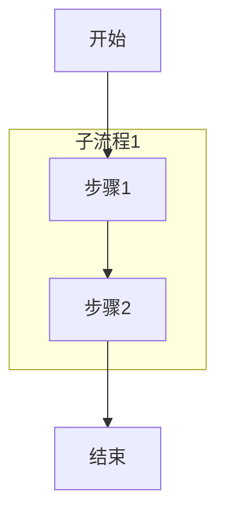
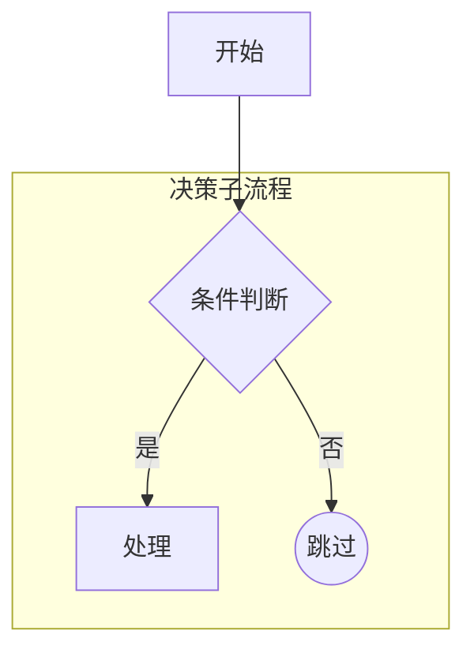
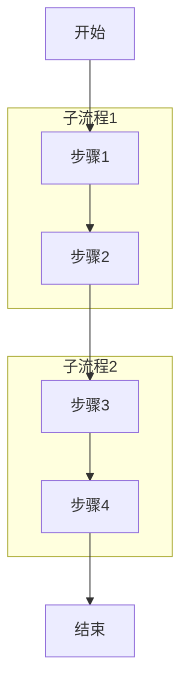
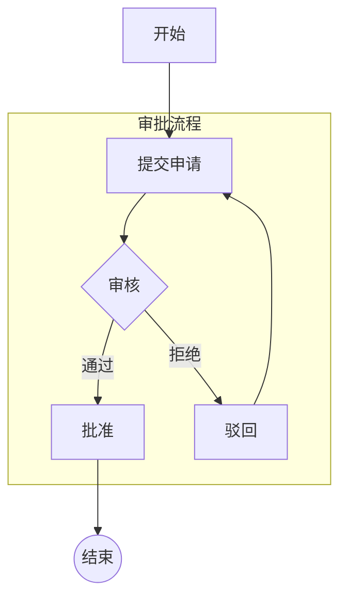
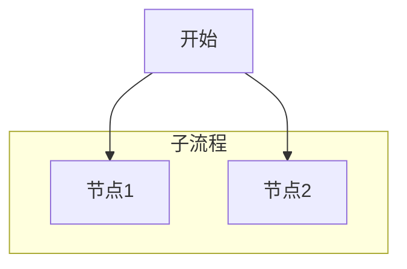
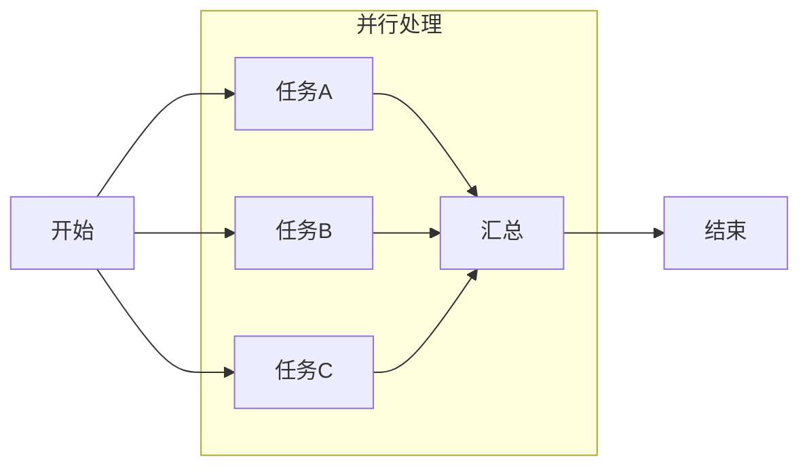
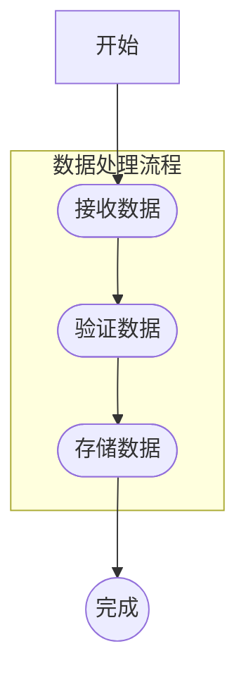
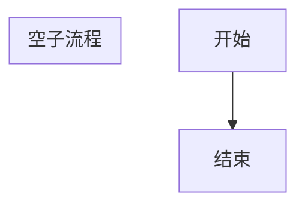

# 子图测试用例文档

## 📊 测试覆盖总结

在原有测试的基础上，新增了 **8个子图相关测试用例**，全面覆盖子图的各种使用场景。

### 测试统计
- **新增测试数量**: 8个
- **测试通过率**: 100%
- **总测试数量**: 30个（原22个 + 新增8个）

---

## 🧪 新增测试用例详情

### 1. `testParseSimpleSubgraph` - 简单子图测试
**测试目标**: 验证基本的子图定义和解析

**Mermaid 输入**:


**验证点**:
- ✅ 节点数量: 4个 (A, B, C, D)
- ✅ 边数量: 3条 (B->C, A->B, C->D)
- ✅ 子图内的边被正确解析
- ✅ 主图到子图的连接正确
- ✅ 子图到主图的连接正确

---

### 2. `testParseSubgraphWithDifferentNodeShapes` - 不同节点形状子图
**测试目标**: 验证子图内支持多种节点形状

**Mermaid 输入**:


**验证点**:
- ✅ 菱形决策节点 (diamond)
- ✅ 矩形节点 (rectangle)
- ✅ 圆形节点 (circle)
- ✅ 边标签正确解析

---

### 3. `testParseMultipleSubgraphs` - 多个并列子图
**测试目标**: 验证多个子图并存的场景

**Mermaid 输入**:


**验证点**:
- ✅ 节点数量: 6个
- ✅ 边数量: 5条
- ✅ 第一个子图的内部边
- ✅ 第二个子图的内部边
- ✅ 子图之间的连接边

---

### 4. `testParseSubgraphWithComplexFlow` - 复杂流程子图（含循环）
**测试目标**: 验证子图内的复杂流程，包括循环

**Mermaid 输入**:


**验证点**:
- ✅ 节点数量: 6个
- ✅ 边数量: 6条
- ✅ 子图内的循环边 (Reject -> Submit)
- ✅ 决策节点及其分支
- ✅ 主图与子图的连接

---

### 5. `testParseSubgraphWithOnlyNodes` - 仅包含节点的子图
**测试目标**: 验证子图内只定义节点，没有边的场景

**Mermaid 输入**:


**验证点**:
- ✅ 节点数量: 3个
- ✅ 边数量: 2条（只有主图到子图的边）
- ✅ 子图内无边

---

### 6. `testParseSubgraphWithParallelBranches` - 并行分支子图
**测试目标**: 验证子图内的并行处理模式

**Mermaid 输入**:


**验证点**:
- ✅ 节点数量: 6个
- ✅ 边数量: 7条
- ✅ 三个任务节点汇聚到一个节点
- ✅ 起始节点向三个任务分发
- ✅ LR（左到右）方向支持

---

### 7. `testParseSubgraphWithRoundRectangleNodes` - 圆角矩形节点子图
**测试目标**: 验证子图内圆角矩形节点的支持

**Mermaid 输入**:


**验证点**:
- ✅ 圆角矩形节点 (round_rectangle)
- ✅ 圆形节点 (circle)
- ✅ 边数量: 4条

---

### 8. `testParseEmptySubgraph` - 空子图
**测试目标**: 验证空子图不影响正常解析

**Mermaid 输入**:


**验证点**:
- ✅ 空子图被正确处理
- ✅ 不影响其他节点和边的解析
- ✅ 节点数量: 2个
- ✅ 边数量: 1条

---

## 📈 测试覆盖矩阵

| 测试场景 | 节点形状 | 边类型 | 子图特性 | 状态 |
|---------|---------|-------|---------|------|
| 简单子图 | 矩形 | 普通箭头 | 单子图 | ✅ |
| 决策子图 | 矩形、菱形、圆形 | 带标签箭头 | 单子图 | ✅ |
| 多子图 | 矩形 | 普通箭头 | 多子图并列 | ✅ |
| 复杂流程 | 矩形、菱形、圆形 | 带标签箭头 | 循环、决策 | ✅ |
| 仅节点子图 | 矩形 | 无内部边 | 子图定义 | ✅ |
| 并行分支 | 矩形 | 普通箭头 | 汇聚模式 | ✅ |
| 圆角矩形 | 圆角矩形、圆形 | 普通箭头 | 多种形状 | ✅ |
| 空子图 | - | - | 边界情况 | ✅ |

---

## 🎯 测试覆盖率

### 节点形状覆盖
- ✅ 矩形 `[文本]`
- ✅ 菱形 `{文本}`
- ✅ 圆形 `((文本))`
- ✅ 圆角矩形 `([文本])`

### 边类型覆盖
- ✅ 普通箭头 `-->`
- ✅ 带标签箭头 `-->|标签|`

### 子图特性覆盖
- ✅ 单个子图
- ✅ 多个并列子图
- ✅ 子图内节点定义
- ✅ 子图内边定义
- ✅ 主图到子图的连接
- ✅ 子图到主图的连接
- ✅ 子图之间的连接
- ✅ 子图内循环
- ✅ 子图内决策分支
- ✅ 子图内并行分支
- ✅ 空子图处理

### 方向覆盖
- ✅ TD (Top Down)
- ✅ LR (Left to Right)

---

## 🚀 运行测试

### 运行所有测试
```bash
./mvnw test
```

### 运行子图相关测试
```bash
./mvnw test -Dtest=FlowParserServiceTest#testParse*Subgraph*
```

### 运行特定测试
```bash
./mvnw test -Dtest=FlowParserServiceTest#testParseSimpleSubgraph
```

---

## 📝 示例程序

查看 `SubgraphExample.java` 了解子图解析的实际效果演示。

运行示例：
```bash
./mvnw compile exec:java -Dexec.mainClass="com.gaibu.flowlab.SubgraphExample"
```

---

## ✅ 测试结论

所有子图相关测试用例均 **100% 通过**，证明了：

1. ✅ 子图定义被正确解析
2. ✅ 子图内的节点和边被正确提取
3. ✅ 子图与主图的连接关系正确
4. ✅ 支持多个并列子图
5. ✅ 支持子图内的复杂流程（循环、决策、并行）
6. ✅ 支持所有节点形状和边类型
7. ✅ 边界情况处理正确（空子图）

**解析器已完全支持 Mermaid 子图特性！** 🎉
