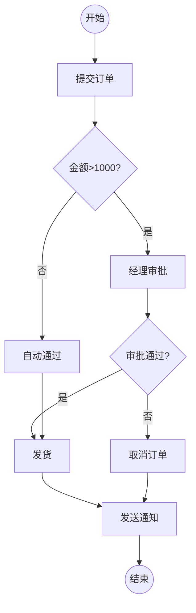

# FlowLab 流程引擎设计文档

## 1. 系统概述

### 1.1 背景

FlowLab 项目已经实现了基于 Mermaid 语法的流程图解析功能，包括词法分析、语法分析和 AST 转换。本文档旨在设计一个流程引擎，能够基于解析后的流程图模型执行实际的业务流程。

### 1.2 目标

- **流程定义管理**：支持流程定义的加载、存储和版本管理
- **流程实例执行**：支持流程实例的创建、启动、暂停、恢复和终止
- **节点执行器**：提供可扩展的节点执行器机制，支持不同类型节点的业务逻辑
- **条件分支**：支持基于表达式的条件判断和分支路由
- **流程上下文**：维护流程执行过程中的变量和状态
- **事件机制**：提供流程执行过程中的事件监听和通知
- **持久化**：支持流程实例和执行状态的持久化存储
- **并发控制**：支持多流程实例并发执行

### 1.3 核心概念

- **流程定义（Process Definition）**：通过 Mermaid 语法定义的流程模板，包含节点和边的结构
- **流程实例（Process Instance）**：流程定义的一次具体执行，包含执行状态和上下文数据
- **节点（Node）**：流程中的执行单元，不同形状的节点代表不同的执行语义
- **边（Edge）**：连接节点的有向边，表示流程的流转方向
- **执行上下文（Execution Context）**：存储流程执行过程中的变量、状态和中间结果
- **节点执行器（Node Executor）**：负责执行特定类型节点的业务逻辑

## 2. 架构设计

### 2.1 整体架构

```
┌─────────────────────────────────────────────────────────────┐
│                        应用层                                │
│  ┌──────────────┐  ┌──────────────┐  ┌──────────────┐      │
│  │ 流程定义管理  │  │ 流程实例管理  │  │  监控与查询   │      │
│  └──────────────┘  └──────────────┘  └──────────────┘      │
└─────────────────────────────────────────────────────────────┘
                            ↓
┌─────────────────────────────────────────────────────────────┐
│                      流程引擎核心层                           │
│  ┌──────────────┐  ┌──────────────┐  ┌──────────────┐      │
│  │  流程解析器   │  │  流程执行器   │  │  事件管理器   │      │
│  └──────────────┘  └──────────────┘  └──────────────┘      │
│  ┌──────────────┐  ┌──────────────┐  ┌──────────────┐      │
│  │ 节点执行器池  │  │ 表达式引擎   │  │  上下文管理   │      │
│  └──────────────┘  └──────────────┘  └──────────────┘      │
└─────────────────────────────────────────────────────────────┘
                            ↓
┌─────────────────────────────────────────────────────────────┐
│                       持久化层                               │
│  ┌──────────────┐  ┌──────────────┐  ┌──────────────┐      │
│  │ 流程定义存储  │  │ 流程实例存储  │  │  执行日志存储 │      │
│  └──────────────┘  └──────────────┘  └──────────────┘      │
└─────────────────────────────────────────────────────────────┘
```

### 2.2 分层说明

#### 2.2.1 应用层
- **流程定义管理**：提供流程定义的 CRUD 操作、版本管理和部署功能
- **流程实例管理**：提供流程实例的创建、启动、暂停、恢复、终止等操作
- **监控与查询**：提供流程执行状态查询、历史记录查询和监控统计

#### 2.2.2 流程引擎核心层
- **流程解析器**：复用现有的 Mermaid 解析器（Lexer + Parser + Transformer）
- **流程执行器**：负责流程实例的执行调度和状态管理
- **节点执行器池**：管理不同类型节点的执行器，支持动态注册和扩展
- **表达式引擎**：用于条件判断和变量计算
- **上下文管理**：管理流程执行上下文和变量作用域
- **事件管理器**：处理流程执行过程中的事件发布和订阅

#### 2.2.3 持久化层
- **流程定义存储**：存储流程定义的元数据和 Mermaid 源码
- **流程实例存储**：存储流程实例的状态、上下文和执行历史
- **执行日志存储**：记录流程执行的详细日志，用于审计和问题排查

## 3. 核心模块设计

### 3.1 流程定义模块

#### 3.1.1 ProcessDefinition（流程定义）

```java
@Entity
@Table(name = "process_definition")
public class ProcessDefinition {
    @Id
    private String id;                    // 流程定义ID
    private String name;                  // 流程名称
    private String description;           // 流程描述
    private Integer version;              // 版本号
    private String mermaidSource;         // Mermaid 源码
    private String flowGraphJson;         // 解析后的 FlowGraph JSON
    private ProcessDefinitionStatus status; // 状态：DRAFT, ACTIVE, ARCHIVED
    private LocalDateTime createdAt;      // 创建时间
    private LocalDateTime updatedAt;      // 更新时间
    private String createdBy;             // 创建人
}
```

#### 3.1.2 ProcessDefinitionService（流程定义服务）

```java
@Service
public class ProcessDefinitionService {
    // 创建流程定义
    ProcessDefinition create(String name, String mermaidSource);

    // 更新流程定义
    ProcessDefinition update(String id, String mermaidSource);

    // 部署流程定义（激活）
    ProcessDefinition deploy(String id);

    // 归档流程定义
    void archive(String id);

    // 查询流程定义
    ProcessDefinition getById(String id);
    ProcessDefinition getLatestVersion(String name);
    List<ProcessDefinition> listAll();
}
```

### 3.2 流程实例模块

#### 3.2.1 ProcessInstance（流程实例）

```java
@Entity
@Table(name = "process_instance")
public class ProcessInstance {
    @Id
    private String id;                    // 流程实例ID
    private String processDefinitionId;   // 流程定义ID
    private String businessKey;           // 业务键
    private ProcessInstanceStatus status; // 状态：RUNNING, SUSPENDED, COMPLETED, TERMINATED
    private String currentNodeId;         // 当前节点ID
    private LocalDateTime startTime;      // 开始时间
    private LocalDateTime endTime;        // 结束时间
    private String startUserId;           // 启动用户

    @OneToOne(cascade = CascadeType.ALL)
    private ExecutionContext context;     // 执行上下文
}
```

#### 3.2.2 ProcessInstanceService（流程实例服务）

```java
@Service
public class ProcessInstanceService {
    // 创建流程实例
    ProcessInstance create(String processDefinitionId, String businessKey, Map<String, Object> variables);

    // 启动流程实例
    void start(String instanceId);

    // 暂停流程实例
    void suspend(String instanceId);

    // 恢复流程实例
    void resume(String instanceId);

    // 终止流程实例
    void terminate(String instanceId);

    // 查询流程实例
    ProcessInstance getById(String instanceId);
    List<ProcessInstance> listByDefinitionId(String definitionId);
    List<ProcessInstance> listByStatus(ProcessInstanceStatus status);
}
```

### 3.3 流程执行引擎模块

#### 3.3.1 ProcessEngine（流程执行引擎）

```java
@Component
public class ProcessEngine {
    private final NodeExecutorRegistry executorRegistry;
    private final ExpressionEngine expressionEngine;
    private final EventPublisher eventPublisher;
    private final ProcessInstanceRepository instanceRepository;

    // 执行流程实例
    public void execute(ProcessInstance instance) {
        // 1. 发布流程启动事件
        eventPublisher.publish(new ProcessStartedEvent(instance));

        // 2. 获取流程定义
        FlowGraph flowGraph = parseFlowGraph(instance.getProcessDefinitionId());

        // 3. 从当前节点开始执行
        String currentNodeId = instance.getCurrentNodeId();
        executeNode(instance, flowGraph, currentNodeId);
    }

    // 执行单个节点
    private void executeNode(ProcessInstance instance, FlowGraph flowGraph, String nodeId) {
        Node node = flowGraph.getNodeById(nodeId);

        // 1. 发布节点开始事件
        eventPublisher.publish(new NodeStartedEvent(instance, nodeId));

        // 2. 获取节点执行器
        NodeExecutor executor = executorRegistry.getExecutor(node.getShape());

        // 3. 执行节点
        NodeExecutionResult result = executor.execute(node, instance.getContext());

        // 4. 发布节点完成事件
        eventPublisher.publish(new NodeCompletedEvent(instance, nodeId, result));

        // 5. 根据执行结果决定下一步
        if (result.isSuccess()) {
            List<String> nextNodeIds = determineNextNodes(flowGraph, nodeId, instance.getContext());
            if (nextNodeIds.isEmpty()) {
                // 流程结束
                completeProcess(instance);
            } else {
                // 继续执行下一个节点
                for (String nextNodeId : nextNodeIds) {
                    executeNode(instance, flowGraph, nextNodeId);
                }
            }
        } else {
            // 节点执行失败，暂停流程
            suspendProcess(instance, result.getErrorMessage());
        }
    }

    // 确定下一个节点
    private List<String> determineNextNodes(FlowGraph flowGraph, String currentNodeId, ExecutionContext context) {
        List<Edge> outgoingEdges = flowGraph.getOutgoingEdges(currentNodeId);
        List<String> nextNodeIds = new ArrayList<>();

        for (Edge edge : outgoingEdges) {
            // 如果边有条件，则评估条件
            if (edge.getLabel() != null && !edge.getLabel().isEmpty()) {
                boolean conditionMet = expressionEngine.evaluate(edge.getLabel(), context);
                if (conditionMet) {
                    nextNodeIds.add(edge.getTo());
                }
            } else {
                // 无条件边，直接添加
                nextNodeIds.add(edge.getTo());
            }
        }

        return nextNodeIds;
    }
}
```

#### 3.3.2 NodeExecutionResult（节点执行结果）

```java
@Data
@Builder
public class NodeExecutionResult {
    private boolean success;              // 是否成功
    private String errorMessage;          // 错误信息
    private Map<String, Object> outputs;  // 输出变量
    private NodeExecutionStatus status;   // 执行状态：SUCCESS, FAILED, WAITING
}
```

### 3.4 节点执行器模块

#### 3.4.1 NodeExecutor（节点执行器接口）

```java
public interface NodeExecutor {
    // 获取支持的节点形状
    String getSupportedShape();

    // 执行节点
    NodeExecutionResult execute(Node node, ExecutionContext context);

    // 验证节点配置
    boolean validate(Node node);
}
```

#### 3.4.2 内置节点执行器

```java
// 开始节点执行器
@Component
public class StartNodeExecutor implements NodeExecutor {
    @Override
    public String getSupportedShape() {
        return "circle";
    }

    @Override
    public NodeExecutionResult execute(Node node, ExecutionContext context) {
        // 开始节点不需要执行任何逻辑，直接返回成功
        return NodeExecutionResult.builder()
            .success(true)
            .status(NodeExecutionStatus.SUCCESS)
            .build();
    }
}

// 任务节点执行器
@Component
public class TaskNodeExecutor implements NodeExecutor {
    @Override
    public String getSupportedShape() {
        return "rectangle";
    }

    @Override
    public NodeExecutionResult execute(Node node, ExecutionContext context) {
        // 执行任务逻辑
        // 可以通过 SPI 机制加载具体的任务处理器
        String taskType = node.getLabel();
        TaskHandler handler = TaskHandlerRegistry.getHandler(taskType);

        if (handler != null) {
            return handler.handle(node, context);
        }

        return NodeExecutionResult.builder()
            .success(true)
            .status(NodeExecutionStatus.SUCCESS)
            .build();
    }
}

// 决策节点执行器
@Component
public class DecisionNodeExecutor implements NodeExecutor {
    @Override
    public String getSupportedShape() {
        return "diamond";
    }

    @Override
    public NodeExecutionResult execute(Node node, ExecutionContext context) {
        // 决策节点不执行逻辑，只是路由
        // 实际的条件判断在 ProcessEngine.determineNextNodes 中进行
        return NodeExecutionResult.builder()
            .success(true)
            .status(NodeExecutionStatus.SUCCESS)
            .build();
    }
}

// 结束节点执行器
@Component
public class EndNodeExecutor implements NodeExecutor {
    @Override
    public String getSupportedShape() {
        return "circle";
    }

    @Override
    public NodeExecutionResult execute(Node node, ExecutionContext context) {
        // 结束节点标记流程完成
        return NodeExecutionResult.builder()
            .success(true)
            .status(NodeExecutionStatus.SUCCESS)
            .build();
    }
}
```

#### 3.4.3 NodeExecutorRegistry（节点执行器注册表）

```java
@Component
public class NodeExecutorRegistry {
    private final Map<String, NodeExecutor> executors = new ConcurrentHashMap<>();

    @Autowired
    public NodeExecutorRegistry(List<NodeExecutor> executorList) {
        // 自动注册所有节点执行器
        for (NodeExecutor executor : executorList) {
            register(executor);
        }
    }

    public void register(NodeExecutor executor) {
        executors.put(executor.getSupportedShape(), executor);
    }

    public NodeExecutor getExecutor(String shape) {
        NodeExecutor executor = executors.get(shape);
        if (executor == null) {
            throw new IllegalArgumentException("No executor found for shape: " + shape);
        }
        return executor;
    }

    public boolean hasExecutor(String shape) {
        return executors.containsKey(shape);
    }
}
```

### 3.5 执行上下文模块

#### 3.5.1 ExecutionContext（执行上下文）

```java
@Entity
@Table(name = "execution_context")
public class ExecutionContext {
    @Id
    private String id;

    @ElementCollection
    @CollectionTable(name = "context_variables")
    private Map<String, Object> variables = new HashMap<>();

    // 设置变量
    public void setVariable(String name, Object value) {
        variables.put(name, value);
    }

    // 获取变量
    public Object getVariable(String name) {
        return variables.get(name);
    }

    // 获取变量（带默认值）
    public <T> T getVariable(String name, T defaultValue) {
        Object value = variables.get(name);
        return value != null ? (T) value : defaultValue;
    }

    // 判断变量是否存在
    public boolean hasVariable(String name) {
        return variables.containsKey(name);
    }

    // 移除变量
    public void removeVariable(String name) {
        variables.remove(name);
    }

    // 获取所有变量
    public Map<String, Object> getAllVariables() {
        return new HashMap<>(variables);
    }

    // 批量设置变量
    public void setVariables(Map<String, Object> vars) {
        if (vars != null) {
            variables.putAll(vars);
        }
    }
}
```

### 3.6 表达式引擎模块

#### 3.6.1 ExpressionEngine（表达式引擎接口）

```java
public interface ExpressionEngine {
    // 评估布尔表达式
    boolean evaluate(String expression, ExecutionContext context);

    // 计算表达式值
    Object calculateValue(String expression, ExecutionContext context);

    // 验证表达式语法
    boolean validateSyntax(String expression);
}
```

#### 3.6.2 SpELExpressionEngine（基于 Spring EL 的实现）

```java
@Component
public class SpELExpressionEngine implements ExpressionEngine {
    private final SpelExpressionParser parser = new SpelExpressionParser();

    @Override
    public boolean evaluate(String expression, ExecutionContext context) {
        try {
            Expression exp = parser.parseExpression(expression);
            StandardEvaluationContext evalContext = createEvaluationContext(context);
            Boolean result = exp.getValue(evalContext, Boolean.class);
            return result != null && result;
        } catch (Exception e) {
            throw new ExpressionEvaluationException("Failed to evaluate expression: " + expression, e);
        }
    }

    @Override
    public Object calculateValue(String expression, ExecutionContext context) {
        try {
            Expression exp = parser.parseExpression(expression);
            StandardEvaluationContext evalContext = createEvaluationContext(context);
            return exp.getValue(evalContext);
        } catch (Exception e) {
            throw new ExpressionEvaluationException("Failed to calculate expression: " + expression, e);
        }
    }

    @Override
    public boolean validateSyntax(String expression) {
        try {
            parser.parseExpression(expression);
            return true;
        } catch (Exception e) {
            return false;
        }
    }

    private StandardEvaluationContext createEvaluationContext(ExecutionContext context) {
        StandardEvaluationContext evalContext = new StandardEvaluationContext();
        // 将流程变量注入到表达式上下文
        context.getAllVariables().forEach(evalContext::setVariable);
        return evalContext;
    }
}
```

### 3.7 事件管理模块

#### 3.7.1 ProcessEvent（流程事件基类）

```java
@Data
public abstract class ProcessEvent {
    private String eventId;
    private String processInstanceId;
    private LocalDateTime timestamp;
    private ProcessEventType eventType;

    public ProcessEvent(String processInstanceId, ProcessEventType eventType) {
        this.eventId = UUID.randomUUID().toString();
        this.processInstanceId = processInstanceId;
        this.eventType = eventType;
        this.timestamp = LocalDateTime.now();
    }
}
```

#### 3.7.2 具体事件类型

```java
// 流程启动事件
public class ProcessStartedEvent extends ProcessEvent {
    private String processDefinitionId;
    private Map<String, Object> initialVariables;

    public ProcessStartedEvent(ProcessInstance instance) {
        super(instance.getId(), ProcessEventType.PROCESS_STARTED);
        this.processDefinitionId = instance.getProcessDefinitionId();
        this.initialVariables = instance.getContext().getAllVariables();
    }
}

// 流程完成事件
public class ProcessCompletedEvent extends ProcessEvent {
    private Map<String, Object> finalVariables;

    public ProcessCompletedEvent(ProcessInstance instance) {
        super(instance.getId(), ProcessEventType.PROCESS_COMPLETED);
        this.finalVariables = instance.getContext().getAllVariables();
    }
}

// 节点开始事件
public class NodeStartedEvent extends ProcessEvent {
    private String nodeId;
    private String nodeLabel;

    public NodeStartedEvent(ProcessInstance instance, String nodeId) {
        super(instance.getId(), ProcessEventType.NODE_STARTED);
        this.nodeId = nodeId;
    }
}

// 节点完成事件
public class NodeCompletedEvent extends ProcessEvent {
    private String nodeId;
    private NodeExecutionResult result;

    public NodeCompletedEvent(ProcessInstance instance, String nodeId, NodeExecutionResult result) {
        super(instance.getId(), ProcessEventType.NODE_COMPLETED);
        this.nodeId = nodeId;
        this.result = result;
    }
}
```

#### 3.7.3 EventListener（事件监听器接口）

```java
public interface EventListener<T extends ProcessEvent> {
    // 处理事件
    void onEvent(T event);

    // 获取支持的事件类型
    Class<T> getSupportedEventType();
}
```

#### 3.7.4 EventPublisher（事件发布器）

```java
@Component
public class EventPublisher {
    private final Map<Class<? extends ProcessEvent>, List<EventListener>> listeners = new ConcurrentHashMap<>();

    @Autowired
    public EventPublisher(List<EventListener> listenerList) {
        // 自动注册所有事件监听器
        for (EventListener listener : listenerList) {
            register(listener);
        }
    }

    public void register(EventListener listener) {
        Class<? extends ProcessEvent> eventType = listener.getSupportedEventType();
        listeners.computeIfAbsent(eventType, k -> new CopyOnWriteArrayList<>()).add(listener);
    }

    public void publish(ProcessEvent event) {
        List<EventListener> eventListeners = listeners.get(event.getClass());
        if (eventListeners != null) {
            for (EventListener listener : eventListeners) {
                try {
                    listener.onEvent(event);
                } catch (Exception e) {
                    // 记录日志，但不影响流程执行
                    log.error("Error handling event: " + event.getEventType(), e);
                }
            }
        }
    }
}
```

## 4. 数据模型设计

### 4.1 数据库表结构

#### 4.1.1 流程定义表（process_definition）

| 字段名 | 类型 | 说明 | 约束 |
|--------|------|------|------|
| id | VARCHAR(64) | 流程定义ID | 主键 |
| name | VARCHAR(255) | 流程名称 | 非空 |
| description | TEXT | 流程描述 | |
| version | INT | 版本号 | 非空，默认1 |
| mermaid_source | TEXT | Mermaid 源码 | 非空 |
| flow_graph_json | TEXT | 解析后的 FlowGraph JSON | 非空 |
| status | VARCHAR(20) | 状态 | 非空，DRAFT/ACTIVE/ARCHIVED |
| created_at | TIMESTAMP | 创建时间 | 非空 |
| updated_at | TIMESTAMP | 更新时间 | 非空 |
| created_by | VARCHAR(64) | 创建人 | |

**索引**：
- `idx_name_version` (name, version) - 唯一索引
- `idx_status` (status)

#### 4.1.2 流程实例表（process_instance）

| 字段名 | 类型 | 说明 | 约束 |
|--------|------|------|------|
| id | VARCHAR(64) | 流程实例ID | 主键 |
| process_definition_id | VARCHAR(64) | 流程定义ID | 非空，外键 |
| business_key | VARCHAR(255) | 业务键 | |
| status | VARCHAR(20) | 状态 | 非空，RUNNING/SUSPENDED/COMPLETED/TERMINATED |
| current_node_id | VARCHAR(64) | 当前节点ID | |
| start_time | TIMESTAMP | 开始时间 | 非空 |
| end_time | TIMESTAMP | 结束时间 | |
| start_user_id | VARCHAR(64) | 启动用户 | |

**索引**：
- `idx_definition_id` (process_definition_id)
- `idx_business_key` (business_key)
- `idx_status` (status)

#### 4.1.3 执行上下文表（execution_context）

| 字段名 | 类型 | 说明 | 约束 |
|--------|------|------|------|
| id | VARCHAR(64) | 上下文ID | 主键 |
| process_instance_id | VARCHAR(64) | 流程实例ID | 非空，外键 |

**索引**：
- `idx_instance_id` (process_instance_id) - 唯一索引

#### 4.1.4 上下文变量表（context_variables）

| 字段名 | 类型 | 说明 | 约束 |
|--------|------|------|------|
| context_id | VARCHAR(64) | 上下文ID | 外键 |
| variable_name | VARCHAR(255) | 变量名 | 非空 |
| variable_value | TEXT | 变量值（JSON） | |
| variable_type | VARCHAR(50) | 变量类型 | |

**索引**：
- `idx_context_id` (context_id)
- 联合主键：(context_id, variable_name)

#### 4.1.5 执行日志表（execution_log）

| 字段名 | 类型 | 说明 | 约束 |
|--------|------|------|------|
| id | BIGINT | 日志ID | 主键，自增 |
| process_instance_id | VARCHAR(64) | 流程实例ID | 非空，外键 |
| node_id | VARCHAR(64) | 节点ID | |
| event_type | VARCHAR(50) | 事件类型 | 非空 |
| event_data | TEXT | 事件数据（JSON） | |
| timestamp | TIMESTAMP | 时间戳 | 非空 |

**索引**：
- `idx_instance_id` (process_instance_id)
- `idx_timestamp` (timestamp)

## 5. 执行流程设计

### 5.1 流程定义创建流程

```
用户提交 Mermaid 源码
    ↓
词法分析（MermaidLexer）
    ↓
语法分析（MermaidParser）
    ↓
生成 AST
    ↓
转换为 FlowGraph（MermaidTransformer）
    ↓
验证流程定义
    ↓
保存到数据库
    ↓
返回流程定义ID
```

### 5.2 流程实例执行流程

```
创建流程实例
    ↓
初始化执行上下文
    ↓
设置初始变量
    ↓
查找开始节点
    ↓
┌─────────────────────────────┐
│   执行节点循环               │
│                             │
│  1. 发布节点开始事件         │
│  2. 获取节点执行器           │
│  3. 执行节点逻辑             │
│  4. 发布节点完成事件         │
│  5. 更新执行上下文           │
│  6. 确定下一个节点           │
│     ├─ 有条件边：评估表达式  │
│     └─ 无条件边：直接流转    │
│  7. 判断是否结束             │
│     ├─ 是：完成流程          │
│     └─ 否：继续执行下一节点  │
└─────────────────────────────┘
    ↓
流程完成
    ↓
发布流程完成事件
    ↓
保存最终状态
```

### 5.3 条件分支处理流程

```
到达决策节点
    ↓
获取所有出边
    ↓
遍历每条边
    ↓
检查边是否有标签（条件）
    ├─ 有标签
    │   ↓
    │   使用表达式引擎评估条件
    │   ↓
    │   条件为真？
    │   ├─ 是：添加到下一节点列表
    │   └─ 否：跳过
    │
    └─ 无标签
        ↓
        直接添加到下一节点列表
    ↓
返回下一节点列表
    ↓
并行执行所有下一节点
```

### 5.4 异常处理流程

```
节点执行过程中
    ↓
捕获异常
    ↓
记录错误日志
    ↓
发布节点失败事件
    ↓
判断异常类型
    ├─ 业务异常
    │   ↓
    │   暂停流程
    │   ↓
    │   等待人工处理
    │
    └─ 系统异常
        ↓
        终止流程
        ↓
        发布流程终止事件
```

## 6. 节点类型和执行语义

### 6.1 节点形状与类型映射

| Mermaid 形状 | 节点类型 | 执行语义 | 执行器 |
|-------------|---------|---------|--------|
| `((文本))` | 圆形 | 开始/结束节点 | StartNodeExecutor / EndNodeExecutor |
| `[文本]` | 矩形 | 任务节点 | TaskNodeExecutor |
| `{文本}` | 菱形 | 决策节点 | DecisionNodeExecutor |
| `([文本])` | 圆角矩形 | 子流程节点 | SubProcessNodeExecutor |

### 6.2 节点执行语义详解

#### 6.2.1 开始节点（圆形）
- **用途**：标记流程的起点
- **执行逻辑**：不执行任何业务逻辑，直接返回成功
- **出边数量**：通常只有一条出边
- **示例**：`((开始))`

#### 6.2.2 任务节点（矩形）
- **用途**：执行具体的业务逻辑
- **执行逻辑**：
  - 根据节点标签查找对应的任务处理器
  - 执行任务处理器的业务逻辑
  - 可以修改执行上下文中的变量
- **出边数量**：一条或多条
- **示例**：`[发送邮件]`、`[调用API]`

#### 6.2.3 决策节点（菱形）
- **用途**：根据条件进行分支路由
- **执行逻辑**：
  - 节点本身不执行业务逻辑
  - 通过出边的标签（条件表达式）决定流转方向
  - 支持多条件分支
- **出边数量**：两条或多条（每条边应有条件标签）
- **示例**：`{金额>1000?}`

#### 6.2.4 结束节点（圆形）
- **用途**：标记流程的终点
- **执行逻辑**：标记流程完成，触发流程完成事件
- **出边数量**：无
- **示例**：`((结束))`

### 6.3 条件表达式语法

支持 Spring Expression Language (SpEL) 语法：

```java
// 比较运算
#amount > 1000
#status == 'approved'
#count >= 10

// 逻辑运算
#amount > 1000 and #status == 'pending'
#type == 'A' or #type == 'B'
not #isExpired

// 方法调用
#user.hasRole('admin')
#date.isAfter(#now)

// 三元运算
#amount > 1000 ? 'high' : 'low'
```

## 7. API 设计

### 7.1 流程定义管理 API

#### 7.1.1 创建流程定义

```http
POST /api/process-definitions
Content-Type: application/json

{
  "name": "订单审批流程",
  "description": "订单金额超过1000需要审批",
  "mermaidSource": "flowchart TD\n  A((开始)) --> B[提交订单]\n  ..."
}

Response:
{
  "id": "pd_123456",
  "name": "订单审批流程",
  "version": 1,
  "status": "DRAFT"
}
```

#### 7.1.2 部署流程定义

```http
POST /api/process-definitions/{id}/deploy

Response:
{
  "id": "pd_123456",
  "status": "ACTIVE"
}
```

#### 7.1.3 查询流程定义

```http
GET /api/process-definitions/{id}
GET /api/process-definitions?name={name}&status={status}
```

### 7.2 流程实例管理 API

#### 7.2.1 创建并启动流程实例

```http
POST /api/process-instances
Content-Type: application/json

{
  "processDefinitionId": "pd_123456",
  "businessKey": "order_789",
  "variables": {
    "amount": 1500,
    "userId": "user_001"
  }
}

Response:
{
  "id": "pi_987654",
  "processDefinitionId": "pd_123456",
  "businessKey": "order_789",
  "status": "RUNNING",
  "currentNodeId": "A"
}
```

#### 7.2.2 查询流程实例

```http
GET /api/process-instances/{id}
GET /api/process-instances?businessKey={key}
GET /api/process-instances?status={status}
```

#### 7.2.3 暂停流程实例

```http
POST /api/process-instances/{id}/suspend
```

#### 7.2.4 恢复流程实例

```http
POST /api/process-instances/{id}/resume
```

#### 7.2.5 终止流程实例

```http
POST /api/process-instances/{id}/terminate
```

### 7.3 执行上下文 API

#### 7.3.1 获取流程变量

```http
GET /api/process-instances/{id}/variables
GET /api/process-instances/{id}/variables/{name}
```

#### 7.3.2 设置流程变量

```http
PUT /api/process-instances/{id}/variables
Content-Type: application/json

{
  "amount": 2000,
  "approver": "manager_001"
}
```

### 7.4 执行历史查询 API

#### 7.4.1 查询执行日志

```http
GET /api/process-instances/{id}/logs
GET /api/process-instances/{id}/logs?nodeId={nodeId}
```

## 8. 技术选型

### 8.1 核心技术栈

| 技术 | 版本 | 用途 |
|------|------|------|
| Java | 17 | 开发语言 |
| Spring Boot | 4.0.1 | 应用框架 |
| Spring Data JPA | 4.0.1 | 数据持久化 |
| Spring Expression Language | 6.2.1 | 表达式引擎 |
| MySQL | 8.0+ | 关系数据库 |
| Jackson | 2.18.2 | JSON 序列化 |
| Lombok | 1.18.36 | 减少样板代码 |
| JUnit 5 | 5.11.4 | 单元测试 |

### 8.2 技术选型理由

#### 8.2.1 Spring Expression Language (SpEL)
- **优势**：
  - Spring 生态原生支持，无需额外依赖
  - 语法简洁，易于学习
  - 支持丰富的运算符和方法调用
  - 性能优秀，有缓存机制
- **适用场景**：条件表达式评估、变量计算

#### 8.2.2 Spring Data JPA
- **优势**：
  - 简化数据访问层开发
  - 自动生成 CRUD 操作
  - 支持复杂查询和分页
  - 事务管理完善
- **适用场景**：流程定义、流程实例、执行上下文的持久化

#### 8.2.3 事件驱动架构
- **优势**：
  - 解耦流程引擎核心逻辑和监控、日志等功能
  - 易于扩展和维护
  - 支持异步处理
- **实现方式**：自定义事件发布订阅机制

## 9. 扩展性设计

### 9.1 节点执行器扩展

通过实现 `NodeExecutor` 接口，可以自定义节点执行逻辑：

```java
@Component
public class CustomNodeExecutor implements NodeExecutor {
    @Override
    public String getSupportedShape() {
        return "custom_shape";
    }

    @Override
    public NodeExecutionResult execute(Node node, ExecutionContext context) {
        // 自定义执行逻辑
        return NodeExecutionResult.builder()
            .success(true)
            .status(NodeExecutionStatus.SUCCESS)
            .build();
    }

    @Override
    public boolean validate(Node node) {
        // 验证节点配置
        return true;
    }
}
```

### 9.2 任务处理器扩展

通过 SPI 机制注册自定义任务处理器：

```java
public interface TaskHandler {
    String getTaskType();
    NodeExecutionResult handle(Node node, ExecutionContext context);
}

@Component
public class EmailTaskHandler implements TaskHandler {
    @Override
    public String getTaskType() {
        return "发送邮件";
    }

    @Override
    public NodeExecutionResult handle(Node node, ExecutionContext context) {
        // 发送邮件逻辑
        String recipient = (String) context.getVariable("recipient");
        String subject = (String) context.getVariable("subject");
        // ... 发送邮件
        return NodeExecutionResult.builder()
            .success(true)
            .status(NodeExecutionStatus.SUCCESS)
            .build();
    }
}
```

### 9.3 事件监听器扩展

通过实现 `EventListener` 接口，可以监听流程事件：

```java
@Component
public class ProcessLogListener implements EventListener<ProcessStartedEvent> {
    @Override
    public void onEvent(ProcessStartedEvent event) {
        // 记录流程启动日志
        log.info("Process started: {}", event.getProcessInstanceId());
    }

    @Override
    public Class<ProcessStartedEvent> getSupportedEventType() {
        return ProcessStartedEvent.class;
    }
}
```

## 10. 实施计划

### 10.1 第一阶段：核心引擎开发

**目标**：实现流程引擎的核心功能

**任务清单**：
1. 创建数据模型和实体类
   - ProcessDefinition
   - ProcessInstance
   - ExecutionContext
   - 相关枚举类型

2. 实现持久化层
   - Repository 接口定义
   - 数据库表创建脚本

3. 实现流程定义管理
   - ProcessDefinitionService
   - 集成现有的 Mermaid 解析器

4. 实现执行上下文管理
   - ExecutionContext 实现
   - 变量存储和检索

5. 实现基础节点执行器
   - StartNodeExecutor
   - TaskNodeExecutor
   - DecisionNodeExecutor
   - EndNodeExecutor
   - NodeExecutorRegistry

6. 实现流程执行引擎
   - ProcessEngine 核心逻辑
   - 节点执行循环
   - 条件分支处理

### 10.2 第二阶段：表达式引擎和事件系统

**目标**：实现条件分支和事件机制

**任务清单**：
1. 集成 Spring Expression Language
   - ExpressionEngine 接口
   - SpELExpressionEngine 实现
   - 表达式验证和评估

2. 实现事件管理系统
   - ProcessEvent 基类
   - 具体事件类型
   - EventPublisher
   - EventListener 接口

3. 实现执行日志记录
   - ExecutionLog 实体
   - 日志监听器
   - 日志查询接口

### 10.3 第三阶段：API 和服务层

**目标**：提供完整的 REST API

**任务清单**：
1. 实现流程定义管理 API
   - ProcessDefinitionController
   - 创建、部署、查询接口

2. 实现流程实例管理 API
   - ProcessInstanceController
   - 创建、启动、暂停、恢复、终止接口

3. 实现执行上下文 API
   - 变量查询和设置接口

4. 实现执行历史查询 API
   - 日志查询接口

### 10.4 第四阶段：测试和优化

**目标**：确保系统稳定性和性能

**任务清单**：
1. 单元测试
   - 各模块单元测试
   - 测试覆盖率 > 80%

2. 集成测试
   - 端到端流程测试
   - API 集成测试

3. 性能测试
   - 并发执行测试
   - 大规模流程测试

4. 文档完善
   - API 文档
   - 使用手册
   - 开发指南

## 11. 使用示例

### 11.1 完整流程示例

#### 11.1.1 定义流程（Mermaid 语法）



#### 11.1.2 创建流程定义

```java
@Autowired
private ProcessDefinitionService definitionService;

String mermaidSource = """
    flowchart TD
        A((开始)) --> B[提交订单]
        B --> C{金额>1000?}
        C -->|#amount > 1000| D[经理审批]
        C -->|#amount <= 1000| E[自动通过]
        D --> F{审批通过?}
        F -->|#approved == true| G[发货]
        F -->|#approved == false| H[取消订单]
        E --> G
        G --> I[发送通知]
        H --> I
        I --> J((结束))
    """;

ProcessDefinition definition = definitionService.create(
    "订单审批流程",
    mermaidSource
);

// 部署流程
definitionService.deploy(definition.getId());
```

#### 11.1.3 启动流程实例

```java
@Autowired
private ProcessInstanceService instanceService;
@Autowired
private ProcessEngine processEngine;

// 创建流程实例
Map<String, Object> variables = new HashMap<>();
variables.put("orderId", "ORDER_001");
variables.put("amount", 1500);
variables.put("userId", "user_123");

ProcessInstance instance = instanceService.create(
    definition.getId(),
    "ORDER_001",
    variables
);

// 启动流程
processEngine.execute(instance);
```

#### 11.1.4 自定义任务处理器

```java
@Component
public class OrderSubmitTaskHandler implements TaskHandler {
    @Override
    public String getTaskType() {
        return "提交订单";
    }

    @Override
    public NodeExecutionResult handle(Node node, ExecutionContext context) {
        String orderId = (String) context.getVariable("orderId");
        Integer amount = (Integer) context.getVariable("amount");

        // 执行订单提交逻辑
        log.info("提交订单: orderId={}, amount={}", orderId, amount);

        // 保存订单到数据库
        // ...

        return NodeExecutionResult.builder()
            .success(true)
            .status(NodeExecutionStatus.SUCCESS)
            .build();
    }
}

@Component
public class ManagerApprovalTaskHandler implements TaskHandler {
    @Override
    public String getTaskType() {
        return "经理审批";
    }

    @Override
    public NodeExecutionResult handle(Node node, ExecutionContext context) {
        // 这里可以暂停流程，等待人工审批
        // 或者调用外部审批系统

        // 模拟审批结果
        boolean approved = true;
        context.setVariable("approved", approved);

        return NodeExecutionResult.builder()
            .success(true)
            .status(NodeExecutionStatus.SUCCESS)
            .build();
    }
}
```

#### 11.1.5 监听流程事件

```java
@Component
public class OrderProcessListener implements EventListener<NodeCompletedEvent> {
    @Override
    public void onEvent(NodeCompletedEvent event) {
        log.info("节点完成: instanceId={}, nodeId={}",
            event.getProcessInstanceId(),
            event.getNodeId());

        // 可以在这里发送通知、更新数据库等
    }

    @Override
    public Class<NodeCompletedEvent> getSupportedEventType() {
        return NodeCompletedEvent.class;
    }
}
```

### 11.2 REST API 使用示例

#### 11.2.1 创建流程定义

```bash
curl -X POST http://localhost:8080/api/process-definitions \
  -H "Content-Type: application/json" \
  -d '{
    "name": "订单审批流程",
    "description": "订单金额超过1000需要审批",
    "mermaidSource": "flowchart TD\n  A((开始)) --> B[提交订单]\n  ..."
  }'
```

#### 11.2.2 启动流程实例

```bash
curl -X POST http://localhost:8080/api/process-instances \
  -H "Content-Type: application/json" \
  -d '{
    "processDefinitionId": "pd_123456",
    "businessKey": "ORDER_001",
    "variables": {
      "amount": 1500,
      "userId": "user_123"
    }
  }'
```

#### 11.2.3 查询流程实例

```bash
curl http://localhost:8080/api/process-instances/pi_987654
```

#### 11.2.4 更新流程变量

```bash
curl -X PUT http://localhost:8080/api/process-instances/pi_987654/variables \
  -H "Content-Type: application/json" \
  -d '{
    "approved": true
  }'
```

## 12. 总结

本设计文档详细描述了基于现有 Mermaid 解析器实现流程引擎的完整方案。主要特点包括：

1. **复用现有解析能力**：充分利用已实现的词法分析、语法分析和 AST 转换功能
2. **模块化设计**：清晰的分层架构，各模块职责明确
3. **高度可扩展**：支持自定义节点执行器、任务处理器和事件监听器
4. **事件驱动**：通过事件机制实现解耦和扩展
5. **表达式支持**：使用 SpEL 实现灵活的条件分支
6. **完整的 API**：提供 REST API 支持流程定义和实例管理

通过本设计方案，可以将静态的 Mermaid 流程图转变为可执行的业务流程，为业务系统提供强大的流程编排能力。

