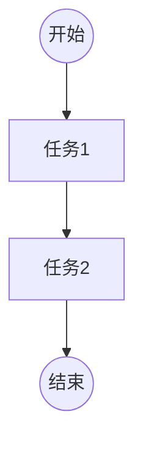
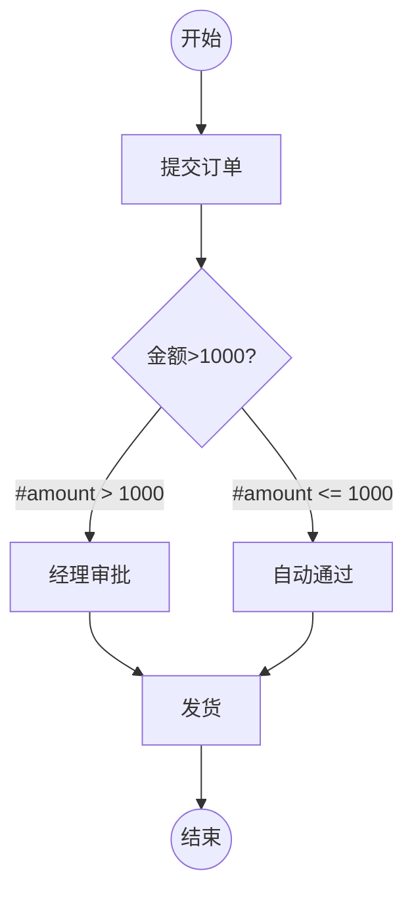
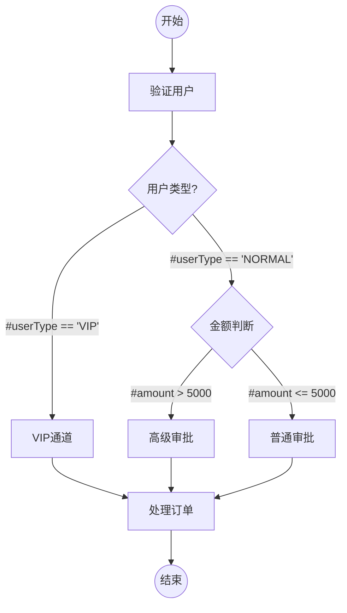

# FlowLab 流程引擎测试用例设计方案

## 1. 文档概述

### 1.1 文档目的

本文档旨在为 FlowLab 流程引擎提供全面的测试用例设计方案，确保流程引擎的各个模块功能正确、稳定、可靠。

### 1.2 适用范围

本测试方案适用于 FlowLab 流程引擎的所有核心模块，包括：
- 数据模型和枚举类型
- 节点执行器
- 表达式引擎
- 事件管理系统
- 流程执行引擎
- 服务层
- 端到端集成测试

### 1.3 测试环境

- **开发语言**：Java 17
- **测试框架**：JUnit 5
- **断言库**：AssertJ
- **构建工具**：Maven

## 2. 测试目标

### 2.1 功能测试目标

- 验证流程定义的创建、更新、部署、归档功能
- 验证流程实例的创建、启动、暂停、恢复、终止功能
- 验证节点执行器的正确执行逻辑
- 验证表达式引擎的条件评估能力
- 验证事件管理系统的发布和订阅机制
- 验证流程执行引擎的完整执行流程

### 2.2 非功能测试目标

- 验证系统的并发处理能力
- 验证异常情况的处理机制
- 验证数据一致性和完整性

### 2.3 测试覆盖率目标

- 单元测试覆盖率：≥ 80%
- 集成测试覆盖率：≥ 70%
- 核心业务逻辑覆盖率：100%

## 3. 测试策略

### 3.1 测试层次

#### 3.1.1 单元测试
- 针对单个类或方法的测试
- 使用 Mock 对象隔离依赖
- 快速执行，频繁运行

#### 3.1.2 集成测试
- 测试多个模块之间的协作
- 使用真实对象，不使用 Mock
- 验证端到端的业务流程

#### 3.1.3 系统测试
- 完整的流程执行测试
- 模拟真实业务场景
- 验证系统整体功能

### 3.2 测试方法

- **等价类划分**：将输入数据划分为有效等价类和无效等价类
- **边界值分析**：测试边界条件和临界值
- **错误推测**：基于经验推测可能出现的错误
- **场景测试**：模拟真实业务场景进行测试

## 4. 测试用例设计

### 4.1 数据模型测试

#### 4.1.1 ExecutionContext 测试

**测试类**：`ExecutionContextTest`

| 用例ID | 用例名称 | 测试步骤 | 预期结果 |
|--------|---------|---------|---------|
| EC-001 | 设置和获取变量 | 1. 创建 ExecutionContext<br>2. 设置变量 "key1" = "value1"<br>3. 获取变量 "key1" | 返回 "value1" |
| EC-002 | 获取不存在的变量 | 1. 创建 ExecutionContext<br>2. 获取不存在的变量 "key2" | 返回 null |
| EC-003 | 获取变量带默认值 | 1. 创建 ExecutionContext<br>2. 获取不存在的变量 "key3"，默认值 "default" | 返回 "default" |
| EC-004 | 判断变量是否存在 | 1. 创建 ExecutionContext<br>2. 设置变量 "key4" = "value4"<br>3. 判断 "key4" 是否存在<br>4. 判断 "key5" 是否存在 | "key4" 存在，"key5" 不存在 |
| EC-005 | 移除变量 | 1. 创建 ExecutionContext<br>2. 设置变量 "key6" = "value6"<br>3. 移除变量 "key6"<br>4. 获取变量 "key6" | 返回 null |
| EC-006 | 批量设置变量 | 1. 创建 ExecutionContext<br>2. 批量设置多个变量<br>3. 获取所有变量 | 返回包含所有设置的变量的 Map |
| EC-007 | 获取所有变量 | 1. 创建 ExecutionContext<br>2. 设置多个变量<br>3. 获取所有变量 | 返回包含所有变量的 Map 副本 |

#### 4.1.2 ProcessDefinition 测试

**测试类**：`ProcessDefinitionTest`

| 用例ID | 用例名称 | 测试步骤 | 预期结果 |
|--------|---------|---------|---------|
| PD-001 | 创建流程定义 | 1. 创建 ProcessDefinition 对象<br>2. 设置所有必要属性 | 对象创建成功，属性设置正确 |
| PD-002 | 验证状态枚举 | 1. 验证 DRAFT 状态<br>2. 验证 ACTIVE 状态<br>3. 验证 ARCHIVED 状态 | 所有状态枚举正确 |

#### 4.1.3 ProcessInstance 测试

**测试类**：`ProcessInstanceTest`

| 用例ID | 用例名称 | 测试步骤 | 预期结果 |
|--------|---------|---------|---------|
| PI-001 | 创建流程实例 | 1. 创建 ProcessInstance 对象<br>2. 设置所有必要属性<br>3. 关联 ExecutionContext | 对象创建成功，属性设置正确 |
| PI-002 | 验证状态枚举 | 1. 验证 RUNNING 状态<br>2. 验证 SUSPENDED 状态<br>3. 验证 COMPLETED 状态<br>4. 验证 TERMINATED 状态 | 所有状态枚举正确 |

### 4.2 节点执行器测试

#### 4.2.1 StartNodeExecutor 测试

**测试类**：`StartNodeExecutorTest`

| 用例ID | 用例名称 | 测试步骤 | 预期结果 |
|--------|---------|---------|---------|
| SNE-001 | 获取支持的节点形状 | 1. 创建 StartNodeExecutor<br>2. 调用 getSupportedShape() | 返回 "circle" |
| SNE-002 | 执行开始节点 | 1. 创建 StartNodeExecutor<br>2. 创建圆形节点<br>3. 创建 ExecutionContext<br>4. 执行节点 | 返回成功结果，状态为 SUCCESS |
| SNE-003 | 验证圆形节点 | 1. 创建 StartNodeExecutor<br>2. 创建圆形节点<br>3. 验证节点 | 返回 true |
| SNE-004 | 验证非圆形节点 | 1. 创建 StartNodeExecutor<br>2. 创建矩形节点<br>3. 验证节点 | 返回 false |

#### 4.2.2 TaskNodeExecutor 测试

**测试类**：`TaskNodeExecutorTest`

| 用例ID | 用例名称 | 测试步骤 | 预期结果 |
|--------|---------|---------|---------|
| TNE-001 | 获取支持的节点形状 | 1. 创建 TaskNodeExecutor<br>2. 调用 getSupportedShape() | 返回 "rectangle" |
| TNE-002 | 执行任务节点 | 1. 创建 TaskNodeExecutor<br>2. 创建矩形节点<br>3. 创建 ExecutionContext<br>4. 执行节点 | 返回成功结果，状态为 SUCCESS |
| TNE-003 | 验证任务执行后的上下文 | 1. 创建 TaskNodeExecutor<br>2. 创建节点，标签为 "测试任务"<br>3. 执行节点<br>4. 检查上下文变量 | 上下文中包含 "lastExecutedTask" = "测试任务" |
| TNE-004 | 验证矩形节点 | 1. 创建 TaskNodeExecutor<br>2. 创建矩形节点<br>3. 验证节点 | 返回 true |

#### 4.2.3 DecisionNodeExecutor 测试

**测试类**：`DecisionNodeExecutorTest`

| 用例ID | 用例名称 | 测试步骤 | 预期结果 |
|--------|---------|---------|---------|
| DNE-001 | 获取支持的节点形状 | 1. 创建 DecisionNodeExecutor<br>2. 调用 getSupportedShape() | 返回 "diamond" |
| DNE-002 | 执行决策节点 | 1. 创建 DecisionNodeExecutor<br>2. 创建菱形节点<br>3. 创建 ExecutionContext<br>4. 执行节点 | 返回成功结果，状态为 SUCCESS |
| DNE-003 | 验证菱形节点 | 1. 创建 DecisionNodeExecutor<br>2. 创建菱形节点<br>3. 验证节点 | 返回 true |

#### 4.2.4 EndNodeExecutor 测试

**测试类**：`EndNodeExecutorTest`

| 用例ID | 用例名称 | 测试步骤 | 预期结果 |
|--------|---------|---------|---------|
| ENE-001 | 获取支持的节点形状 | 1. 创建 EndNodeExecutor<br>2. 调用 getSupportedShape() | 返回 "circle" |
| ENE-002 | 执行结束节点 | 1. 创建 EndNodeExecutor<br>2. 创建圆形节点<br>3. 创建 ExecutionContext<br>4. 执行节点 | 返回成功结果，状态为 SUCCESS |
| ENE-003 | 验证结束节点设置完成标志 | 1. 创建 EndNodeExecutor<br>2. 执行节点<br>3. 检查上下文变量 | 上下文中包含 "processCompleted" = true |

#### 4.2.5 NodeExecutorRegistry 测试

**测试类**：`NodeExecutorRegistryTest`

| 用例ID | 用例名称 | 测试步骤 | 预期结果 |
|--------|---------|---------|---------|
| NER-001 | 注册节点执行器 | 1. 创建 NodeExecutorRegistry<br>2. 注册多个执行器<br>3. 验证注册成功 | 所有执行器注册成功 |
| NER-002 | 获取已注册的执行器 | 1. 创建 NodeExecutorRegistry<br>2. 注册执行器<br>3. 根据形状获取执行器 | 返回对应的执行器 |
| NER-003 | 获取未注册的执行器 | 1. 创建 NodeExecutorRegistry<br>2. 获取未注册的形状的执行器 | 抛出 IllegalArgumentException |
| NER-004 | 判断执行器是否存在 | 1. 创建 NodeExecutorRegistry<br>2. 注册执行器<br>3. 判断已注册和未注册的形状 | 已注册返回 true，未注册返回 false |

### 4.3 表达式引擎测试

#### 4.3.1 SpELExpressionEngine 测试

**测试类**：`SpELExpressionEngineTest`

| 用例ID | 用例名称 | 测试步骤 | 预期结果 |
|--------|---------|---------|---------|
| EE-001 | 评估简单布尔表达式 | 1. 创建 SpELExpressionEngine<br>2. 创建 ExecutionContext，设置 amount=1500<br>3. 评估表达式 "#amount > 1000" | 返回 true |
| EE-002 | 评估复杂布尔表达式 | 1. 创建 SpELExpressionEngine<br>2. 设置 amount=1500, status="pending"<br>3. 评估 "#amount > 1000 and #status == 'pending'" | 返回 true |
| EE-003 | 评估逻辑运算表达式 | 1. 创建 SpELExpressionEngine<br>2. 设置 type="A"<br>3. 评估 "#type == 'A' or #type == 'B'" | 返回 true |
| EE-004 | 评估比较运算表达式 | 1. 创建 SpELExpressionEngine<br>2. 设置 count=10<br>3. 评估 "#count >= 10" | 返回 true |
| EE-005 | 评估不等式表达式 | 1. 创建 SpELExpressionEngine<br>2. 设置 status="approved"<br>3. 评估 "#status != 'rejected'" | 返回 true |
| EE-006 | 计算表达式值 | 1. 创建 SpELExpressionEngine<br>2. 设置 price=100, quantity=5<br>3. 计算 "#price * #quantity" | 返回 500 |
| EE-007 | 验证有效表达式语法 | 1. 创建 SpELExpressionEngine<br>2. 验证 "#amount > 1000" | 返回 true |
| EE-008 | 验证无效表达式语法 | 1. 创建 SpELExpressionEngine<br>2. 验证 "#amount >" | 返回 false |
| EE-009 | 评估表达式时变量不存在 | 1. 创建 SpELExpressionEngine<br>2. 不设置任何变量<br>3. 评估 "#amount > 1000" | 抛出 ExpressionEvaluationException |
| EE-010 | 评估表达式时类型不匹配 | 1. 创建 SpELExpressionEngine<br>2. 设置 amount="abc"<br>3. 评估 "#amount > 1000" | 抛出 ExpressionEvaluationException |

### 4.4 事件管理系统测试

#### 4.4.1 ProcessEvent 测试

**测试类**：`ProcessEventTest`

| 用例ID | 用例名称 | 测试步骤 | 预期结果 |
|--------|---------|---------|---------|
| PE-001 | 创建流程启动事件 | 1. 创建 ProcessInstance<br>2. 创建 ProcessStartedEvent<br>3. 验证事件属性 | 事件ID、实例ID、时间戳、事件类型正确 |
| PE-002 | 创建流程完成事件 | 1. 创建 ProcessInstance<br>2. 创建 ProcessCompletedEvent<br>3. 验证事件属性 | 事件包含最终变量 |
| PE-003 | 创建节点开始事件 | 1. 创建 ProcessInstance<br>2. 创建 NodeStartedEvent<br>3. 验证事件属性 | 事件包含节点ID和标签 |
| PE-004 | 创建节点完成事件 | 1. 创建 ProcessInstance<br>2. 创建 NodeExecutionResult<br>3. 创建 NodeCompletedEvent<br>4. 验证事件属性 | 事件包含节点ID和执行结果 |

#### 4.4.2 EventPublisher 测试

**测试类**：`EventPublisherTest`

| 用例ID | 用例名称 | 测试步骤 | 预期结果 |
|--------|---------|---------|---------|
| EP-001 | 注册事件监听器 | 1. 创建 EventPublisher<br>2. 创建监听器<br>3. 注册监听器 | 监听器注册成功 |
| EP-002 | 发布事件并触发监听器 | 1. 创建 EventPublisher<br>2. 注册监听器<br>3. 发布事件<br>4. 验证监听器被调用 | 监听器的 onEvent 方法被调用 |
| EP-003 | 发布事件给多个监听器 | 1. 创建 EventPublisher<br>2. 注册多个监听器<br>3. 发布事件<br>4. 验证所有监听器被调用 | 所有监听器都被调用 |
| EP-004 | 监听器抛出异常不影响其他监听器 | 1. 创建 EventPublisher<br>2. 注册两个监听器，第一个抛异常<br>3. 发布事件<br>4. 验证第二个监听器仍被调用 | 第二个监听器正常执行 |
| EP-005 | 发布未注册类型的事件 | 1. 创建 EventPublisher<br>2. 不注册监听器<br>3. 发布事件 | 不抛出异常，正常执行 |

### 4.5 流程执行引擎测试

#### 4.5.1 ProcessEngine 测试

**测试类**：`ProcessEngineTest`

| 用例ID | 用例名称 | 测试步骤 | 预期结果 |
|--------|---------|---------|---------|
| PEN-001 | 执行简单线性流程 | 1. 创建简单流程：开始→任务→结束<br>2. 创建流程实例<br>3. 执行流程<br>4. 验证流程状态 | 流程状态为 COMPLETED |
| PEN-002 | 执行带条件分支的流程（条件为真） | 1. 创建流程：开始→决策→任务A/任务B→结束<br>2. 设置变量使条件为真<br>3. 执行流程<br>4. 验证执行路径 | 执行任务A，流程完成 |
| PEN-003 | 执行带条件分支的流程（条件为假） | 1. 创建流程：开始→决策→任务A/任务B→结束<br>2. 设置变量使条件为假<br>3. 执行流程<br>4. 验证执行路径 | 执行任务B，流程完成 |
| PEN-004 | 查找开始节点 | 1. 创建包含多个节点的流程<br>2. 调用 findStartNode<br>3. 验证返回的节点 | 返回没有入边的圆形节点 |
| PEN-005 | 查找开始节点失败 | 1. 创建没有开始节点的流程<br>2. 执行流程 | 抛出 IllegalStateException |
| PEN-006 | 获取节点的出边 | 1. 创建流程图<br>2. 获取指定节点的出边<br>3. 验证出边列表 | 返回正确的出边列表 |
| PEN-007 | 获取节点的入边 | 1. 创建流程图<br>2. 获取指定节点的入边<br>3. 验证入边列表 | 返回正确的入边列表 |
| PEN-008 | 节点执行失败时暂停流程 | 1. 创建流程<br>2. 模拟节点执行失败<br>3. 执行流程<br>4. 验证流程状态 | 流程状态为 SUSPENDED |
| PEN-009 | 发布流程启动事件 | 1. 创建流程<br>2. 注册事件监听器<br>3. 执行流程<br>4. 验证事件被发布 | ProcessStartedEvent 被发布 |
| PEN-010 | 发布节点执行事件 | 1. 创建流程<br>2. 注册事件监听器<br>3. 执行流程<br>4. 验证事件被发布 | NodeStartedEvent 和 NodeCompletedEvent 被发布 |

### 4.6 服务层测试

#### 4.6.1 ProcessDefinitionService 测试

**测试类**：`ProcessDefinitionServiceTest`

| 用例ID | 用例名称 | 测试步骤 | 预期结果 |
|--------|---------|---------|---------|
| PDS-001 | 创建流程定义 | 1. 创建 ProcessDefinitionService<br>2. 提供有效的 Mermaid 源码<br>3. 创建流程定义<br>4. 验证返回结果 | 流程定义创建成功，状态为 DRAFT，版本为 1 |
| PDS-002 | 创建同名流程定义（版本递增） | 1. 创建第一个流程定义<br>2. 创建同名的第二个流程定义<br>3. 验证版本号 | 第二个流程定义版本为 2 |
| PDS-003 | 创建流程定义时 Mermaid 源码无效 | 1. 创建 ProcessDefinitionService<br>2. 提供无效的 Mermaid 源码<br>3. 尝试创建流程定义 | 抛出 IllegalArgumentException |
| PDS-004 | 更新流程定义 | 1. 创建流程定义<br>2. 更新 Mermaid 源码<br>3. 验证更新结果 | 流程定义更新成功，updatedAt 时间更新 |
| PDS-005 | 更新非草稿状态的流程定义 | 1. 创建并部署流程定义<br>2. 尝试更新流程定义 | 抛出 IllegalStateException |
| PDS-006 | 部署流程定义 | 1. 创建流程定义<br>2. 部署流程定义<br>3. 验证状态 | 流程定义状态变为 ACTIVE |
| PDS-007 | 归档流程定义 | 1. 创建并部署流程定义<br>2. 归档流程定义<br>3. 验证状态 | 流程定义状态变为 ARCHIVED |
| PDS-008 | 根据ID查询流程定义 | 1. 创建流程定义<br>2. 根据ID查询<br>3. 验证返回结果 | 返回正确的流程定义 |
| PDS-009 | 查询不存在的流程定义 | 1. 根据不存在的ID查询 | 返回 null |
| PDS-010 | 获取最新版本的流程定义 | 1. 创建多个版本的流程定义<br>2. 获取最新版本<br>3. 验证返回结果 | 返回版本号最大的流程定义 |
| PDS-011 | 列出所有流程定义 | 1. 创建多个流程定义<br>2. 列出所有流程定义<br>3. 验证返回结果 | 返回所有流程定义的列表 |

#### 4.6.2 ProcessInstanceService 测试

**测试类**：`ProcessInstanceServiceTest`

| 用例ID | 用例名称 | 测试步骤 | 预期结果 |
|--------|---------|---------|---------|
| PIS-001 | 创建流程实例 | 1. 创建流程定义<br>2. 创建流程实例<br>3. 验证返回结果 | 流程实例创建成功，状态为 RUNNING |
| PIS-002 | 创建流程实例时流程定义不存在 | 1. 使用不存在的流程定义ID<br>2. 尝试创建流程实例 | 抛出 IllegalArgumentException |
| PIS-003 | 创建流程实例并设置初始变量 | 1. 创建流程定义<br>2. 创建流程实例，设置变量<br>3. 验证上下文变量 | 上下文包含设置的变量 |
| PIS-004 | 启动流程实例 | 1. 创建流程实例<br>2. 启动流程实例<br>3. 验证流程执行 | 流程执行完成 |
| PIS-005 | 创建并启动流程实例 | 1. 调用 createAndStart<br>2. 验证流程状态 | 流程实例创建并执行完成 |
| PIS-006 | 暂停流程实例 | 1. 创建运行中的流程实例<br>2. 暂停流程实例<br>3. 验证状态 | 流程状态变为 SUSPENDED |
| PIS-007 | 暂停非运行中的流程实例 | 1. 创建已完成的流程实例<br>2. 尝试暂停流程实例 | 抛出 IllegalStateException |
| PIS-008 | 恢复流程实例 | 1. 创建并暂停流程实例<br>2. 恢复流程实例<br>3. 验证状态 | 流程状态变为 RUNNING，继续执行 |
| PIS-009 | 恢复非暂停状态的流程实例 | 1. 创建运行中的流程实例<br>2. 尝试恢复流程实例 | 抛出 IllegalStateException |
| PIS-010 | 终止流程实例 | 1. 创建运行中的流程实例<br>2. 终止流程实例<br>3. 验证状态 | 流程状态变为 TERMINATED，设置结束时间 |
| PIS-011 | 根据ID查询流程实例 | 1. 创建流程实例<br>2. 根据ID查询<br>3. 验证返回结果 | 返回正确的流程实例 |
| PIS-012 | 根据流程定义ID查询流程实例 | 1. 创建多个流程实例<br>2. 根据流程定义ID查询<br>3. 验证返回结果 | 返回该流程定义的所有实例 |
| PIS-013 | 根据状态查询流程实例 | 1. 创建不同状态的流程实例<br>2. 根据状态查询<br>3. 验证返回结果 | 返回指定状态的所有实例 |

### 4.7 集成测试

#### 4.7.1 端到端流程测试

**测试类**：`ProcessEngineIntegrationTest`

| 用例ID | 用例名称 | 测试步骤 | 预期结果 |
|--------|---------|---------|---------|
| INT-001 | 订单审批流程（金额>1000） | 1. 创建订单审批流程定义<br>2. 创建流程实例，设置 amount=1500<br>3. 启动流程<br>4. 验证执行路径和最终状态 | 执行"经理审批"分支，流程完成 |
| INT-002 | 订单审批流程（金额≤1000） | 1. 创建订单审批流程定义<br>2. 创建流程实例，设置 amount=500<br>3. 启动流程<br>4. 验证执行路径和最终状态 | 执行"自动通过"分支，流程完成 |
| INT-003 | 多实例并发执行 | 1. 创建流程定义<br>2. 创建多个流程实例<br>3. 并发启动所有实例<br>4. 验证所有实例正确执行 | 所有实例独立执行，互不影响 |
| INT-004 | 流程暂停和恢复 | 1. 创建流程定义<br>2. 创建并启动流程实例<br>3. 在执行过程中暂停<br>4. 恢复流程<br>5. 验证流程继续执行 | 流程从暂停点继续执行并完成 |
| INT-005 | 事件监听器完整流程 | 1. 创建流程定义<br>2. 注册多个事件监听器<br>3. 创建并启动流程实例<br>4. 验证所有事件被正确触发 | 所有事件按顺序触发 |
| INT-006 | 复杂条件分支流程 | 1. 创建包含多个决策节点的流程<br>2. 设置不同的变量组合<br>3. 执行流程<br>4. 验证执行路径 | 根据条件正确选择执行路径 |
| INT-007 | 流程定义版本管理 | 1. 创建流程定义 v1<br>2. 创建流程定义 v2<br>3. 使用 v1 创建实例<br>4. 使用 v2 创建实例<br>5. 验证两个实例使用不同版本 | 不同版本的流程定义独立执行 |

## 5. 测试数据准备

### 5.1 流程定义测试数据

#### 5.1.1 简单线性流程



#### 5.1.2 条件分支流程



#### 5.1.3 复杂条件流程



### 5.2 流程变量测试数据

| 场景 | 变量名 | 变量值 | 数据类型 | 说明 |
|------|--------|--------|---------|------|
| 订单审批-高金额 | amount | 1500 | Integer | 触发经理审批分支 |
| 订单审批-低金额 | amount | 500 | Integer | 触发自动通过分支 |
| 订单审批-边界值 | amount | 1000 | Integer | 测试边界条件 |
| 用户类型-VIP | userType | "VIP" | String | VIP用户 |
| 用户类型-普通 | userType | "NORMAL" | String | 普通用户 |
| 布尔条件-真 | approved | true | Boolean | 审批通过 |
| 布尔条件-假 | approved | false | Boolean | 审批拒绝 |

## 6. 测试执行计划

### 6.1 测试阶段划分

#### 阶段一：单元测试（第1-2周）
- **目标**：完成所有单元测试用例
- **范围**：数据模型、节点执行器、表达式引擎、事件管理
- **预期产出**：单元测试覆盖率 ≥ 80%

#### 阶段二：集成测试（第3周）
- **目标**：完成流程执行引擎和服务层测试
- **范围**：ProcessEngine、ProcessDefinitionService、ProcessInstanceService
- **预期产出**：集成测试覆盖率 ≥ 70%

#### 阶段三：端到端测试（第4周）
- **目标**：完成完整业务流程测试
- **范围**：订单审批、用户注册等业务场景
- **预期产出**：核心业务流程测试通过率 100%

### 6.2 测试环境配置

```xml
<!-- pom.xml 测试依赖 -->
<dependencies>
    <!-- JUnit 5 -->
    <dependency>
        <groupId>org.junit.jupiter</groupId>
        <artifactId>junit-jupiter</artifactId>
        <scope>test</scope>
    </dependency>

    <!-- AssertJ -->
    <dependency>
        <groupId>org.assertj</groupId>
        <artifactId>assertj-core</artifactId>
        <scope>test</scope>
    </dependency>

    <!-- Mockito -->
    <dependency>
        <groupId>org.mockito</groupId>
        <artifactId>mockito-core</artifactId>
        <scope>test</scope>
    </dependency>
</dependencies>
```

### 6.3 测试执行命令

```bash
# 运行所有测试
./mvnw test

# 运行单个测试类
./mvnw test -Dtest=ExecutionContextTest

# 运行特定包下的测试
./mvnw test -Dtest=com.gaibu.flowlab.engine.executor.*

# 生成测试覆盖率报告
./mvnw test jacoco:report
```

### 6.4 测试通过标准

| 测试类型 | 通过标准 |
|---------|---------|
| 单元测试 | 所有测试用例通过，覆盖率 ≥ 80% |
| 集成测试 | 所有测试用例通过，覆盖率 ≥ 70% |
| 端到端测试 | 核心业务流程测试通过率 100% |
| 性能测试 | 单个流程执行时间 < 100ms |
| 并发测试 | 支持 100 个并发流程实例 |

## 7. 测试风险和应对措施

### 7.1 测试风险

| 风险ID | 风险描述 | 风险等级 | 应对措施 |
|--------|---------|---------|---------|
| R-001 | 表达式引擎评估失败 | 高 | 增加表达式语法验证，提供详细错误信息 |
| R-002 | 并发执行时数据不一致 | 高 | 使用线程安全的数据结构，增加并发测试 |
| R-003 | 流程执行死循环 | 中 | 增加执行步数限制，超时自动终止 |
| R-004 | 事件监听器异常影响流程 | 中 | 事件处理异常捕获，不影响主流程 |
| R-005 | 内存泄漏 | 低 | 定期清理已完成的流程实例 |

### 7.2 测试依赖

- 依赖 Mermaid 解析器正常工作
- 依赖 Spring Expression Language 正确评估表达式
- 依赖 JUnit 5 和 AssertJ 测试框架

## 8. 测试总结

### 8.1 测试用例统计

| 测试模块 | 测试用例数 | 优先级 |
|---------|-----------|--------|
| 数据模型测试 | 9 | P0 |
| 节点执行器测试 | 16 | P0 |
| 表达式引擎测试 | 10 | P0 |
| 事件管理系统测试 | 9 | P1 |
| 流程执行引擎测试 | 10 | P0 |
| 服务层测试 | 24 | P0 |
| 集成测试 | 7 | P0 |
| **总计** | **85** | - |

### 8.2 测试覆盖范围

- ✅ 数据模型和枚举类型
- ✅ 节点执行器（Start、Task、Decision、End）
- ✅ 表达式引擎（SpEL）
- ✅ 事件管理系统（发布订阅）
- ✅ 流程执行引擎（核心逻辑）
- ✅ 服务层（流程定义、流程实例）
- ✅ 端到端集成测试

### 8.3 后续改进建议

1. **增加性能测试**：测试大规模流程执行的性能表现
2. **增加压力测试**：测试系统在高并发下的稳定性
3. **增加安全测试**：测试表达式注入等安全问题
4. **增加兼容性测试**：测试不同 JDK 版本的兼容性
5. **自动化测试**：集成到 CI/CD 流程中自动执行

---

**文档版本**：v1.0
**创建日期**：2025-01-17
**最后更新**：2025-01-17
