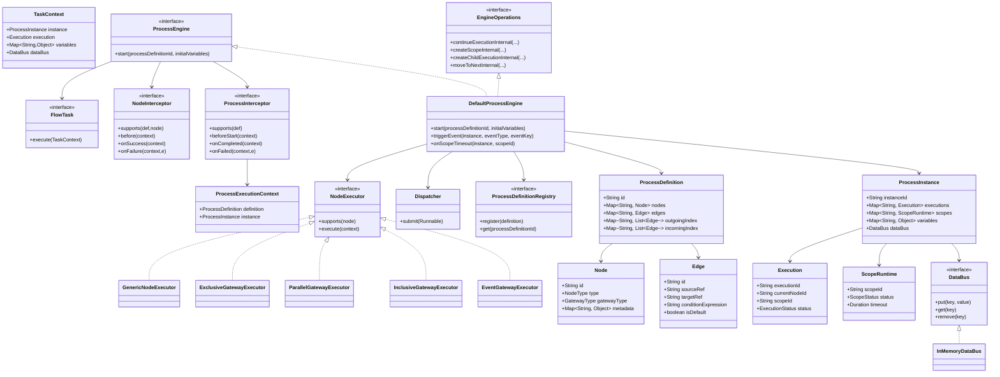

```mermaid
classDiagram

%% =========================
%% Definition Layer
%% =========================

class ProcessDefinition {
    +String id
    +Map~String, Node~ nodes
    +Map~String, Edge~ edges
    +Map~String, List~Edge~~ outgoingIndex
    +Map~String, List~Edge~~ incomingIndex
}

class Node {
    +String id
    +NodeType type
    +GatewayType gatewayType
    +Map~String, Object~ metadata
}

class Edge {
    +String id
    +String sourceRef
    +String targetRef
    +String conditionExpression
    +boolean isDefault
}

ProcessDefinition --> Node
ProcessDefinition --> Edge


%% =========================
%% Runtime Layer
%% =========================

class ProcessInstance {
    +String instanceId
    +Map~String, Execution~ executions
    +Map~String, ScopeRuntime~ scopes
    +Map~String, Object~ variables
    +DataBus dataBus
}

class Execution {
    +String executionId
    +String currentNodeId
    +String scopeId
    +ExecutionStatus status
}

class ScopeRuntime {
    +String scopeId
    +ScopeStatus status
    +Duration timeout
}

ProcessInstance --> Execution
ProcessInstance --> ScopeRuntime


%% =========================
%% Task Layer (Spring)
%% =========================

class FlowTask {
    <<interface>>
    +execute(TaskContext)
}

class TaskContext {
    +ProcessInstance instance
    +Execution execution
    +Map~String,Object~ variables
    +DataBus dataBus
}

class DataBus {
    <<interface>>
    +put(key, value)
    +get(key)
    +remove(key)
}

class InMemoryDataBus

ProcessEngine --> FlowTask
ProcessInstance --> DataBus
DataBus <|.. InMemoryDataBus


%% =========================
%% Interceptor Layer
%% =========================

class NodeInterceptor {
    <<interface>>
    +supports(def,node)
    +before(context)
    +onSuccess(context)
    +onFailure(context,e)
}

class ProcessInterceptor {
    <<interface>>
    +supports(def)
    +beforeStart(context)
    +onCompleted(context)
    +onFailed(context,e)
}

class ProcessExecutionContext {
    +ProcessDefinition definition
    +ProcessInstance instance
}

ProcessEngine --> NodeInterceptor
ProcessEngine --> ProcessInterceptor
ProcessInterceptor --> ProcessExecutionContext


%% =========================
%% Engine Layer
%% =========================

class ProcessEngine {
    <<interface>>
    +start(processDefinitionId, initialVariables)
}

class ProcessDefinitionRegistry {
    <<interface>>
    +register(definition)
    +get(processDefinitionId)
}

class DefaultProcessEngine {
    +start(processDefinitionId, initialVariables)
    +triggerEvent(instance, eventType, eventKey)
    +onScopeTimeout(instance, scopeId)
}

class NodeExecutor {
    <<interface>>
    +supports(node)
    +execute(context)
}

class GenericNodeExecutor
class ExclusiveGatewayExecutor
class ParallelGatewayExecutor
class InclusiveGatewayExecutor
class EventGatewayExecutor

class EngineOperations {
    <<interface>>
    +continueExecutionInternal(...)
    +createScopeInternal(...)
    +createChildExecutionInternal(...)
    +moveToNextInternal(...)
}

class Dispatcher {
    +submit(Runnable)
}

ProcessEngine <|.. DefaultProcessEngine
EngineOperations <|.. DefaultProcessEngine
NodeExecutor <|.. GenericNodeExecutor
NodeExecutor <|.. ExclusiveGatewayExecutor
NodeExecutor <|.. ParallelGatewayExecutor
NodeExecutor <|.. InclusiveGatewayExecutor
NodeExecutor <|.. EventGatewayExecutor
DefaultProcessEngine --> NodeExecutor
DefaultProcessEngine --> Dispatcher
DefaultProcessEngine --> ProcessDefinitionRegistry
DefaultProcessEngine --> ProcessDefinition
DefaultProcessEngine --> ProcessInstance
```
